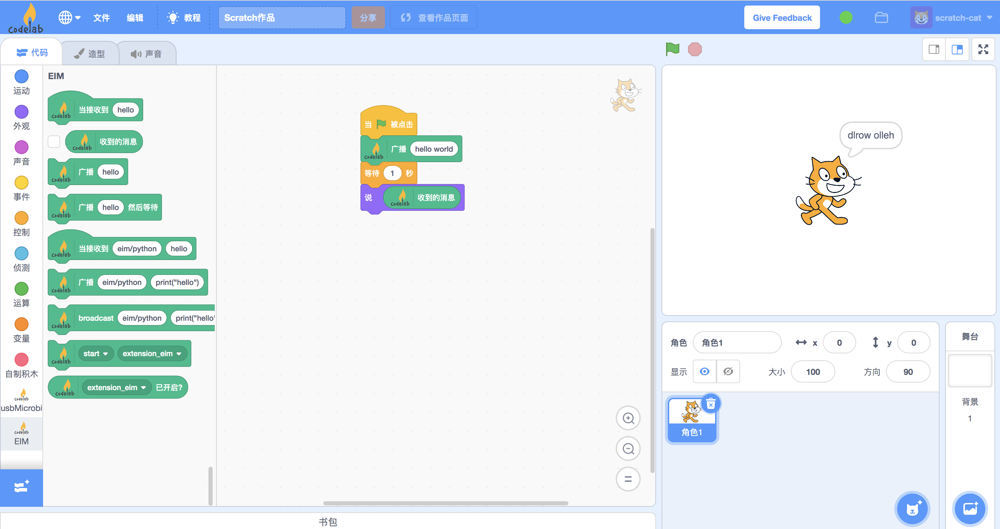

# Adapter Node

在上一节：[hello world(Adapter Extension)](/dev_guide/helloworld/) 中我们学会了如何自定义一个 extension。

extension 有如下的限制：

1.  必须放置在插件目录中（`~/codelab_adapter/extensions`）。
2.  只能使用 CodeLab Adapter [已打包的第三方库](https://github.com/CodeLabClub/codelab_adapter_extensions/wiki)。

如果你想使用 Python 社区海量的第三方库：诸如 [Pygame](https://github.com/pygame/pygame)、[PyQt](https://zh.wikipedia.org/zh-hans/PyQt)、[PyTorch](https://pytorch.org/)、[flask](https://flask.palletsprojects.com/)... extension 就办不到了，但 Adapter Node 可以！

ps: 如果你只是想把外部系统接入Adapter，也可以参考更为简单的: [与外部系统通信](/user_guide/%E4%B8%8E%E5%A4%96%E9%83%A8%E7%B3%BB%E7%BB%9F%E9%80%9A%E4%BF%A1/)

!!! 提醒
    实际上 [Adapter Extension](https://github.com/CodeLabClub/codelab_adapter_extensions/tree/master/extensions_v3) 是 AdapterNode 的子类.

我们希望 CodeLab Adapter 专注于连接万物，所以构建了 Adapter Node，允许你在任何地方创建 CodeLab Adapter 的扩展，允许你使用任何 Python 库，无论你准备构建游戏、构建网站、构建深度学习应用还是构建一个机器人！

## Adapter Node 是什么
Adapter Node 只是普通的 Python 程序，继承自 [AdapterNode](https://github.com/CodeLabClub/codelab_adapter_client_python/blob/master/codelab_adapter_client/base.py#L174)。

## 第一个 Adapter Node
我们开始写第一个 Adapter Node。

你需要完成这些前置工作：

*  安装了 Python3(`>=3.6`)
*  pip3 install codelab_adapter_client --upgrade

接着可以随便在什么地方创建一个 Python 文件，随便给它起个名字，诸如`my_first_adapter_node.py`：

我们让这个 Node 的功能与 [hello world](/dev_guide/helloworld/) 里我们自定义的插件功能相同：反转字符串

```python
import time
from loguru import logger
from codelab_adapter_client import AdapterNode


class EIMNode(AdapterNode):
    NODE_ID = "eim"
    DESCRIPTION = "Everything Is a Message"
    HELP_URL = "https://adapter.codelab.club/extension_guide/eim/"

    def __init__(self):
        super().__init__()

    def send_message_to_scratch(self, content):
        message = self.message_template()
        message["payload"]["content"] = content
        self.publish(message)

    def extension_message_handle(self, topic, payload):
        self.logger.info(f'the message payload from scratch: {payload}')
        content = payload["content"]
        if type(content) == str:
            content_send_to_scratch = content[::-1]  # 反转字符串
            self.send_message_to_scratch(content_send_to_scratch)

    def run(self):
        while self._running:
            time.sleep(1)


if __name__ == "__main__":
    try:
        node = EIMNode()
        node.receive_loop_as_thread()
        node.run()
    except KeyboardInterrupt:
        node.terminate()  # Clean up before exiting.
```

## 运行
打开 CodeLab Adapter（不需要选择插件），将 CodeLab Adapter 作为消息中心。

运行 my_first_adapter_node.py：`python3 my_first_adapter_node.py`

让我们在 [CodeLab Scratch3](https://scratch-beta.codelab.club/) 中尝试一下反转字符串：



成功！

它只是普通的 Python 程序，使用你本地的 Python 环境，所以你现在可以任何你偏爱的Python库来增强 Scratch3 啦！

<!--
!!!提醒
    你可以将自定义插件发布到[插件市场](/extension_guide/extension_market/), 用户点击即可下载使用。
-->

## GUI
有开发者在邮件中提到：

>  tkinter、PyQt 都有一个主循环，Adapter Node 也有一个主循环，怎么才能共存呢？

Adapter Node 可以与任何 GUI 框架共存

```
if __name__ == "__main__":
    try:
        node = EIMNode()
        node.receive_loop_as_thread()
        node.run()
    except KeyboardInterrupt:
        node.terminate()  # Clean up before exiting.
```

其中`node.run()`不是必要的，只是为了阻塞程序，使其不立刻结束，如果 GUI 框架本身已经有主循环，则可以移除`node.run()`， `node.receive_loop_as_thread()`是非阻塞的。

以下是示范例子：

```python
from tkinter import *

# AdapterNode
from loguru import logger
from codelab_adapter_client import AdapterNode


class EIMNode(AdapterNode):
    NODE_ID = "eim"

    def __init__(self):
        super().__init__()

    def send_message_to_scratch(self, content):
        message = self.message_template()
        message["payload"]["content"] = content
        self.publish(message)

    def extension_message_handle(self, topic, payload):
        self.logger.info(f'the message payload from scratch: {payload}')
        content = payload["content"]
        if type(content) == str:
            content_send_to_scratch = content[::-1]  # 反转字符串
            self.send_message_to_scratch(content_send_to_scratch)

node = EIMNode()
node.receive_loop_as_thread()

# tkinter
window = Tk()
window.title("Adapter Node & tkinter")
window.geometry('300x100')
lbl = Label(window, text="click to send message")
lbl.grid(column=0, row=0)

i = 1
def clicked():
    global i
    message = node.message_template()
    message["payload"]["content"] = "click_{}".format(i)
    node.publish(message)
    i += 1

btn = Button(window, text="emit", command=clicked)
btn.grid(column=1, row=0)
window.mainloop()
```

该 node 接收来自 Scratch EIM 的消息，并逆转字符串；当用户点击按钮时，给 Scratch 发送消息：`click_<NUMBER>`


## 想象空间
如果你希望构建分布式的应用，诸如构建密室逃脱中的各种机关。只需要[做一下配置就行](/user_guide/settings/#open_message_hub)，让 CodeLab Adapter 接受分布式的请求。

你可以将 Adapter Node 跑在任何地方，来增强 CodeLab Adapter 的能力，无论是本地、云端还是分布式节点。

我们也正在构建其他语言的 client，你不会被限制在 Python 中，而是可以在任何编程语言任何平台上构建 Adapter Node。 参考：[编程语言支持](/dev_guide/multi-language-support/)

## 更多例子
*  [blender](/extension_guide/blender/)：这是个实际的案例，演示如何使用 AdapterNode 基础类粘合不同软件，将其变为 Adapter Node。
*  [examples](https://github.com/CodeLabClub/codelab_adapter_client_python/tree/master/examples)
*  [node_v3](https://github.com/CodeLabClub/codelab_adapter_extensions/tree/master/nodes_v3)
