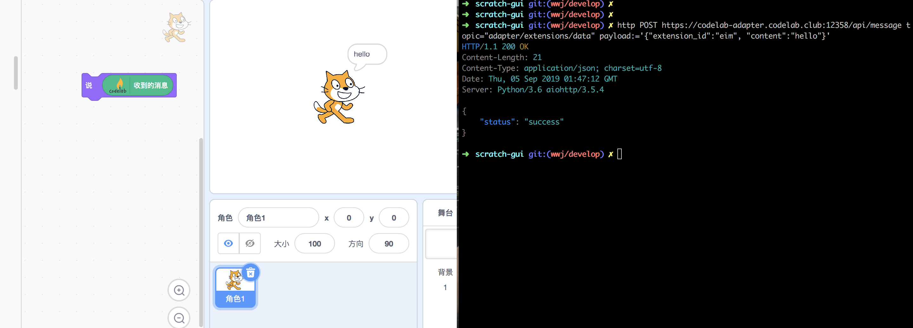
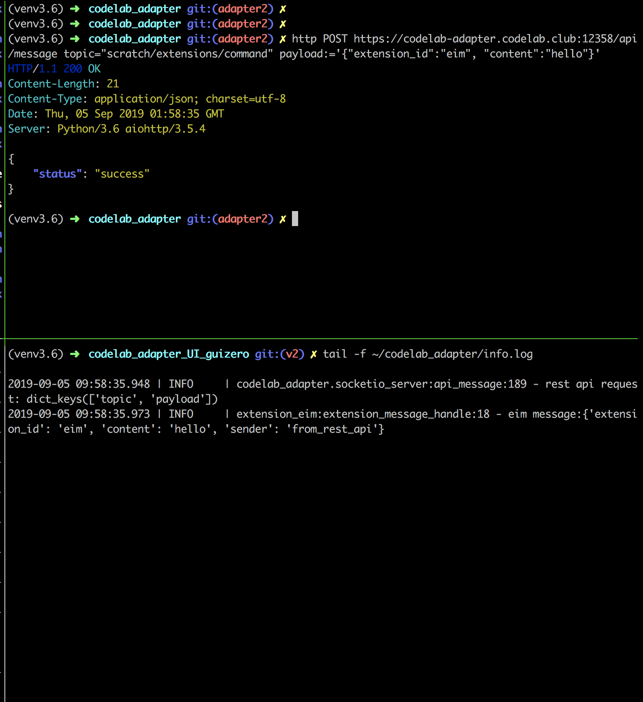
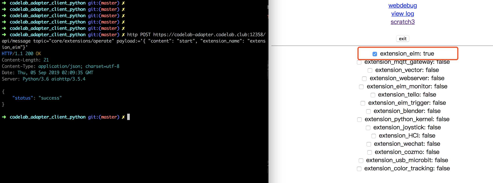
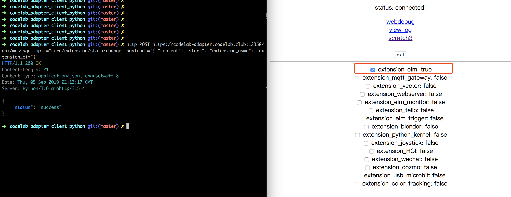

# REST API

CodeLab Adapter 对外提供 REST API。

你可以使用[curl](https://zh.wikipedia.org/zh-cn/CURL)、[httpie](https://httpie.org/)、、[postman](https://www.getpostman.com/)、AJAX 等与它交互。

我最喜欢[httpie](https://httpie.org/), 安装[httpie](https://httpie.org/)很简单: `pip install httpie`

### 设计思路

在设计上，CodeLab Adapter REST API 受到[Home Assistant REST API](https://developers.home-assistant.io/docs/en/external_api_rest.html)影响，它被设计为消息入口，从 REST API 进入的消息，将全部转化为 ZeroMQ 消息，REST API 就像一个透明的消息通道。

在 CodeLab Adapter 中消息有很多入口，gateway 负责将来自不同入口的消息，转化为统一的 ZeroMQ 消息，这种设计风格在 CodeLab Adapter 中很常见。

无论是 MQTT、HTTP、websocket...都被统一转化为 ZeroMQ 消息。

### 准备工作

开始与 REST API 交互之前，确保已经打开了 CodeLab Adapter.

### 发送消息到 Scratch3

使用[httpie](https://httpie.org/)给 Scratch3 发送`hello`消息，对应的命令为:

```bash
http POST https://codelab-adapter.codelab.club:12358/api/message topic="adapter/extensions/data" payload:='{"extension_id":"eim", "content":"hello"}'
```

值得注意的是 payload 是 json 数据，发送 json 数据语法为`:=`, 详情参考[httpie](https://httpie.org/)文档。

CodeLab Scratch3 将成功接受消息:



上述任务，对应的 curl 命令为:

```bash
curl -X POST -H "Content-Type: application/json" \
 -d '{"topic": "adapter/extensions/data","payload":{"extension_id":"eim", "content":"hello"}}' \
 https://codelab-adapter.codelab.club:12358/api/message
```

可以看出[httpie](https://httpie.org/)更加清晰简易。接下来的内容，我们都使用[httpie](https://httpie.org/)，你可以使用[curl2httpie](https://curl2httpie.online/)将其转化为 curl 命令。

### 发送消息到 CodeLab Adapter Extension

运行命令之前，先运行`extension_eim`插件。`extension_eim`插件的[这行代码](https://github.com/Scratch3Lab/codelab_adapter_extensions/blob/master/extensions_v2/extension_eim.py#L18)将打印出它收到的消息。

使用[httpie](https://httpie.org/)给 CodeLab Adapter Extension 发送`hello`消息，对应的命令为:

```bash
http POST https://codelab-adapter.codelab.club:12358/api/message topic="scratch/extensions/command" payload:='{"extension_id":"eim", "content":"hello"}'
```



### 启停插件

由于我们已经将 CodeLab Adapter 内部 API 服务化了，所以使用 REST API 可以对 CodeLab Adapter 做任何粒度的控制（依然是受到[Home Assistant](https://www.home-assistant.io/)的启发）。

开启`extension_eim`插件:

```bash
http POST https://codelab-adapter.codelab.club:12358/api/message topic="core/extensions/operate" payload:='{ "content": "start", "extension_name": "extension_eim"}'
```

在命令运行的瞬间，Web UI 会同步更新。



关闭`extension_eim`插件:

```bash
http POST https://codelab-adapter.codelab.club:12358/api/message topic="core/extensions/operate" payload:='{ "content": "stop", "extension_name": "extension_eim" }'
```

如果你愿意，你可以搞个恶作剧，欺骗 Web UI 说 extension_eim 插件已经开启，但实际上并未开启，恶作剧的命令为:

```bash
http POST https://codelab-adapter.codelab.club:12358/api/message topic="core/extension/statu/change" payload:='{ "content": "start", "extension_name": "extension_eim"}'
```

可以看到 Web UI 成功被你骗过去了。



### 开灯/关灯

如果你在 CodeLab Neverland 空间里，你可以使用 REST API 与空间里的所有事物互动。

开灯:

```bash
http POST https://rpi.codelab.club:12358/api/message topic="to_HA" payload:='{ "content":{"type":"call_service","domain":"light","service":"turn_on","service_data":{"entity_id":"light.yeelight1"}},"extension_id": "eim"}'
```

关灯:

```bash
http POST https://rpi.codelab.club:12358/api/message topic="to_HA" payload:='{ "content":{"type":"call_service","domain":"light","service":"turn_off","service_data":{"entity_id":"light.yeelight1"}},"extension_id": "eim"}'
```

### 升降窗帘

降下窗帘:

```bash
http POST https://rpi.codelab.club:12358/api/message topic="to_HA" payload:='{ "content":{"type":"call_service","domain":"cover","service":"close_cover","service_data":{"entity_id":"cover.0x00158d00034f6a69_cover"}},"extension_id": "eim"}'
```

升起窗帘:

```bash
http POST https://rpi.codelab.club:12358/api/message topic="to_HA" payload:='{ "content":{"type":"call_service","domain":"cover","service":"open_cover","service_data":{"entity_id":"cover.0x00158d00034f6a69_cover"}},"extension_id": "eim"}'
```

### 想象空间
你可以在浏览器中为CodeLab Adapter构建新的图形界面。

或者使用不同语言中写自动化脚本。

它也很适合用来教学http相关的内容。

### 黑客精神
CodeLab Adapter的所有功能都已经被服务化，所以你可以使用REST API来做CodeLab Adapter所能做到的任何事情，无论是控制内部功能，还是发送消息(everything is message)。唯一需要的知识是有关消息的结构，你可以使用`codelab-message-monitor`来观察消息结构。

