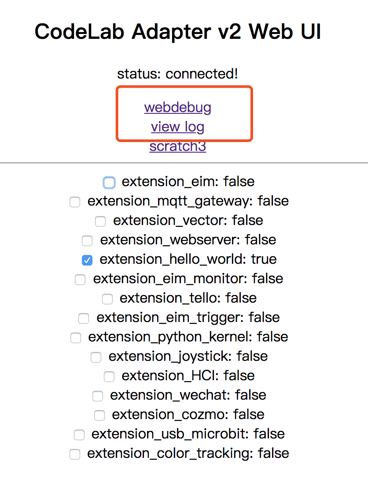

# Debug

## 3 种 debug 方式
Adapter 本质是个消息系统，调试的关键是观察往来的消息。

目前有 3 种 debug 方式：

1.  基于命令行的调试（只能看到消息）
2.  基于日志的调试 (可以看到 log 信息)
3.  基于 web 的调试（只能看到消息）

我自己最偏好第一种：`基于命令行的调试`。如果你希望看到logger信息，则使用第2种方式。

下边逐一陈述。

### 基于命令行的调试

需要本地有 Python 环境（`Python >= 3.6`）

安装`pip install codelab_adapter_client`

codelab_adapter_client 会为你装上 2 个命令行调试工具：

- codelab-message-monitor
- codelab-message-trigger
- codelab-message-pub


运行`codelab-message-monitor`，你将看到在 CodeLab Adapter 中所有往来的消息。这是我目前最依赖的工具。

你也可以自行构建更适合自己的调试脚手架，推荐使用 [sh](http://amoffat.github.io/sh/index.html)，这样你可以方便把 linux 工具箱里的工具都用上，同时又可以在 Python 语言中工作。

```python
# pip install sh codelab_adapter_client
# http://amoffat.github.io/sh/sections/asynchronous_execution.html#incremental-iteration
import sh
for line in sh.codelab_message_monitor(_iter=True):
    try:
        print(sh.ack("10",_in=line))
    except:
        pass
```


### 基于日志的调试

我们在 [hello world #调试技巧](/dev_guide/helloworld/#_4)中提到了基于日志的调试。

在插件中打上日志：`self.logger.info`，之后使用

- `tail -f ~/codelab_adapter/debug.log`
- `tail -f ~/codelab_adapter/info.log`
- `tail -f ~/codelab_adapter/error.log`

便可实时查看日志。

<!--
### 基于 web 的调试

入口在 Web UI 中。


-->

!!! tip

    ### Windows 用户

    Windows 缺少调试 unix/linux 工具集，调试起来可能有诸多不便，推荐使用 [cmder](https://github.com/cmderdev/cmder)，如此一来你就能得到一大包好用的命令行工具。

    ### log 过滤

    如果你觉得 log 输出的信息太多，可以使用 grep 观察你关注的信息，诸如我只关心`extension_hello_world.py`插件输出的信息：

    `tail -f ~/codelab_adapter/info.log | grep extension_hello_world`
