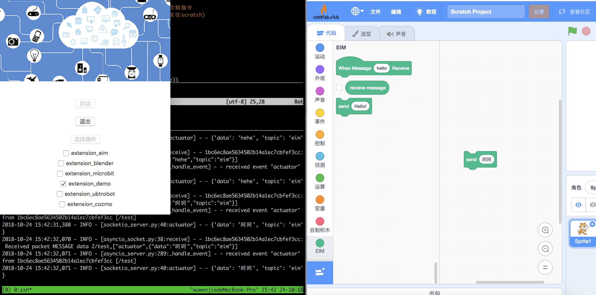
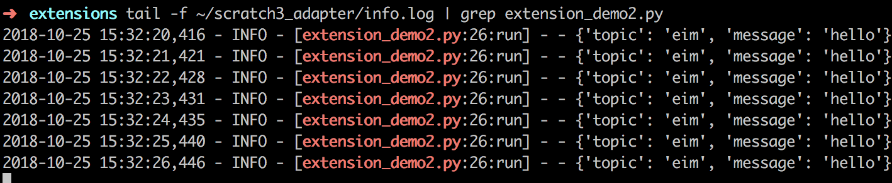

# debug

### 基于web的调试
v0.5.1之后支持基于web的调试。点击`帮助>调试(Debug)`即可。


推荐采用这种调试方式:[codelab-adapter增加调试功能](https://blog.just4fun.site/codelab-adapter-debug.html)

### 给于本地日志的调试
codelab-adapter会将输出写入日志。为了调试方便，开发者可以打开一个命令行窗口，运行:

`tail -f ~/codelab_adapter/info.log`



上图调试的插件源码为:


```python
import time

from codelab_adapter import settings
from codelab_adapter.core_extension import Extension

class DemoExtension(Extension):
    def __init__(self):
        name = type(self).__name__
        super().__init__(name)

    def run(self):
        # run 会被作为线程调用
        while self._running:
            message = self.read()
            self.logger.info("message:%s",str(message))

export = DemoExtension
```

`self.logger.info("message:%s",str(message))`记录的日志信息将实时输出在`tail -f ~/codelab_adapter/info.log`


### tips

### windows用户
windows缺少调试unix/linux工具集，调试起来可能有诸多不便，推荐使用[cmder](https://github.com/cmderdev/cmder)，如此一来你就能得到一大包好用的命令行工具。

### log过滤
如果你觉得log输出的信息太多，可以使用grep观察你关注的信息，诸如我只关心`extension_demo2.py`插件输出的信息:

`tail -f ~/codelab_adapter/info.log | grep extension_demo2.py`



