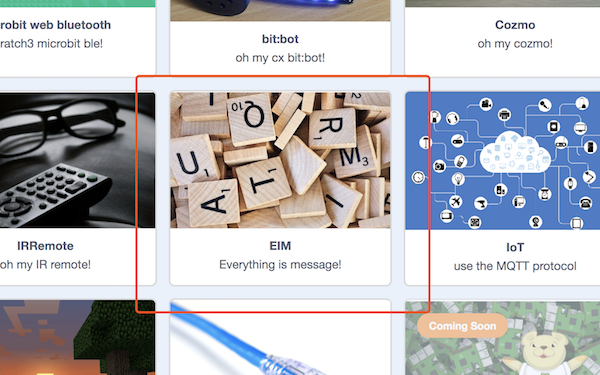
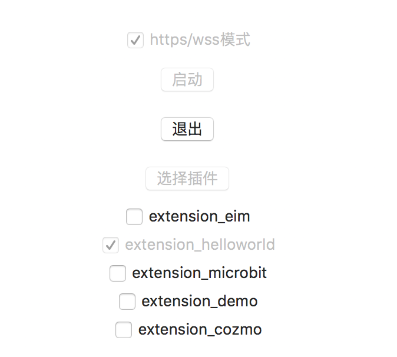

# hello world
我们来写一个自定义插件，实现`hello world`

在上一节的架构图中，你可以看到，一个完整的插件，包含两个部分:

*  scratch3.0网页中的插件(内应)
*  在scratch3_adapter中写一个插件，代理外部硬件设备AI或其他程序

关于第一部分，尽管Scratch3官方的extensions机制已经可用了，我们也在Scratch3.0中写了很多插件，但由于目前文档缺失，不大建议大家来踩坑，等文档全了之后，再折腾不迟(目前官方正在优化Scratch3.0内部的插件系统，一些新的特性包括多语言支持等)。我们在Scratch3 Lab制作了一些通用的消息积木(EIM,本质上是一个Scratch3.0插件)，我们尽量将它做的通用，让开发者只需在scratch3_adapter自定义插件，即可在Scratch3中使用

题外话:  这块的原理我们之后有机会细聊，其实核心概念很简单,如EIM所带表的含义: `Everything Is Message`,消息是一种极其强大的概念，如果你用过zeromq或者erlang大概深有体会

### 目标
在Scratch3 Lab中发送自定义的消息，之后让电脑用语音读出它（我在mac下做实验，如果你用的是其他操作系统，让电脑发音的那一行需要改一下）

# 开始
### 步骤1: 在Scratch3 Lab中打开EIM插件
打开Scratch3 Lab选择EIM插件





### 步骤2: 在scratch3_adapter中写插件

我们的第一个插件起名为`extension_helloworld.py`:

```
import time, threading, subprocess
from scratch3_adapter import settings
from scratch3_adapter.core_extension import Extension

class HelloworldExtension(Extension):
    def __init__(self):
        name = type(self).__name__
        super().__init__(name)

    def run(self):
        while True:
            message = self.read()
            if message["topic"] == "eim":
                # 根据你使用的操作系统对say这个命令做一下调整
                subprocess.call("say {}".format(message["data"]),shell=True)

export = HelloworldExtension
```

一共13行代码，其中真正与我们做的事情相关的只有2行

```
message = self.read()
    if message["topic"] == "eim":
```

就是说其余部分你可以当作模版抄过来

###步骤3: 将插件放到插件目录下，并运行它

打开scratch3_adapter，让我们找到插件目录


在mac和linux下插件目录都是`~/scratch3_adapter/extensions/`，windows下的，可以如上图自行查阅。scratch3_adapter默认内置了四个插件，如果你熟悉Python，稍微翻一下代码，应该很快上手。

需要注意的是插件的命名必须形如`extension_*.py`,我们的插件调度系统只这种命名风格的文件视为插件(至于为何这样设计，而不更宽松一些，之后再说)

将我们刚才写的`extension_helloworld.py`插件放入目录之后，重启scratch3_adapter，你就看到插件了，点击将运行它




ps: 和之前运行micro:bit步骤一样,如果你忘了，翻一下[前边内容](/user_guide/usage/#2-scratch3_adapter)

大功告成!

### 使用演示

<video src="../../img/eim_helloworld.mp4" controls="controls"></video>


### 小结
从这个例子中，我们可以看到写一个自定义的插件有多简单。而scratch3_adapter对插件要做的事几乎没有任何限制，只要Python能做的事，插件系统都运行你做！就是说你可以自己写一个插件，让Scratch3来控制你的蓝牙设、你的ROS机器人、你那跑着opencv的树莓派或者你童年那辆心爱的玩具四驱车

### 更多的拓展
如果你熟悉Scratch3.0的extension系统，你可以在Scratch3.0中创建自己的js extension(如同我们在哦scratch3 lab中做的那些插件)，并与scratch3_adapter连接起来，由于Scratch3.0的extension系统官方还在调整中，暂无文档，这部分的教程，我们等到官方文档完善之后再补上


enjoy it～