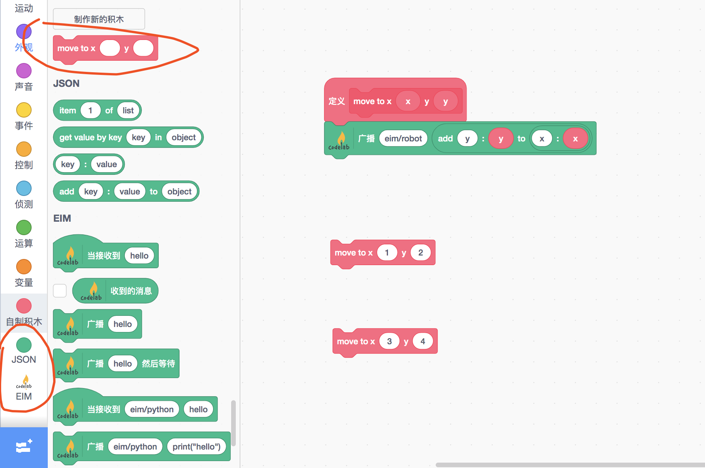
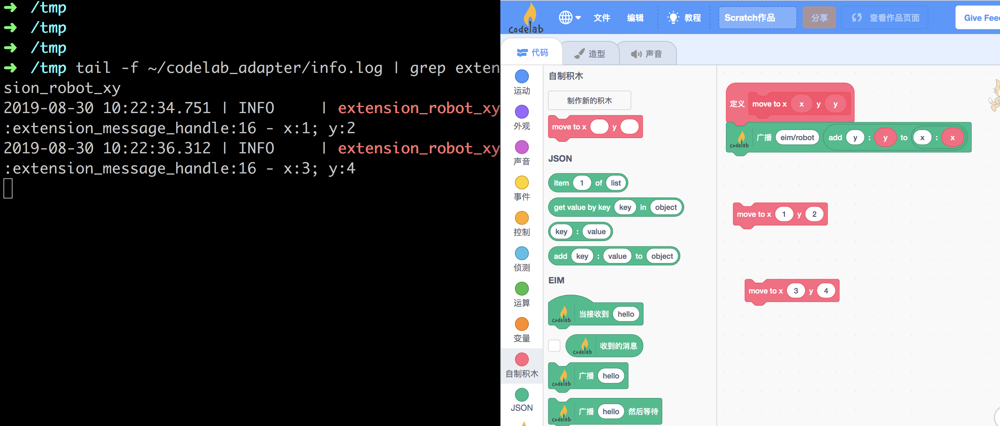
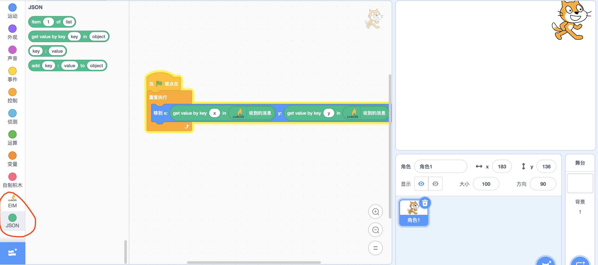

# json message

在[hello world](/dev_guide/helloworld/)案例中，我们构建了这样一个程序: 接收一个来自Scratch3的字符串(`hello world`)，将其反转后(`dlrow olleh`)返回。

有时候字符串是不够用的，如果我们从Scratch3往CodeLab Adapter extension传递更复杂的数据结构怎么办呢？

有两种办法:

1. 自定义Scratch3 extension，拓展payload结构:[payload](https://github.com/Scratch3Lab/scratch3_eim/blob/9716545108fca06f08fcfbf26456a97f3092dd20/index.js#L292)
2. 使用Scratch3 EIM extension，传递json消息。

第二种方式非常简单，不必去碰Scratch的东西，只要使用Python写extension就行，我们在此讨论这种方式。

### 传递x、y坐标
设想这样一种应用场景: 我们希望使用Scratch控制机器人(如Cozmo)移动到特定的坐标位置`(x,y)`。

我们可以通过以下两个步骤完成:

1.  在Scratch3中自定义新的积木
    *  使用Scratch3 json extension构建json数据
    *  使用Scratch3 EIM extension传递消息到CodeLab Adapter
2.  构建CodeLab Adapter插件: `extension_robot_xy.py`, 在插件中处理传递过来的`(x,y)`

### 在Scratch3中自定义新的积木



### 构建CodeLab Adapter插件
```python
import time
from codelab_adapter.core_extension import Extension


class RobotXYExtension(Extension):
    def __init__(self):
        super().__init__()
        self.EXTENSION_ID = "eim/robot"

    def extension_message_handle(self, topic, payload):
        self.logger.debug(f'the message payload from scratch: {payload}')
        content = payload["content"]
        if type(content) == dict:
            x = content["x"]
            y = content["y"]
            self.logger.info(f'x:{x}; y:{y}')

    def run(self):
        while self._running:
            time.sleep(1)

export = RobotXYExtension
```

在此，值得注意的是`self.EXTENSION_ID = "eim/robot"`, 观察前头的截图，可以看出`"eim/robot"`与Scratch3 eim的积木块的对应关系。

### 开始测试
如果你对如何运行CodeLab Adapter extension不熟悉，请参考[hello world](/dev_guide/helloworld/)




### json message from CodeLab Adapter to Scratch3
前头我们学会了如何将json消息从Scratch3发往CodeLab Adapter，接下来我们学习如何将json消息从CodeLab Adapter发往Scratch3。

我们来设计这样一个CodeLab Adapter extension:  每秒钟将一个随机的(x, y)发往Scratch3，使用(x, y)来控制小猫的位置。

我们来修改 `extension_robot_xy.py`


```python
import time
import random
from codelab_adapter.core_extension import Extension


class RobotXYExtension(Extension):
    def __init__(self):
        super().__init__()
        self.EXTENSION_ID = "eim/robot"

    def extension_message_handle(self, topic, payload):
        self.logger.debug(f'the message payload from scratch: {payload}')
        content = payload["content"]
        if type(content) == dict:
            x = content["x"]
            y = content["y"]
            self.logger.info(f'x:{x}; y:{y}')

    def run(self):
        while self._running:
            message = self.message_template()
            random_x = random.randint(-240,240)
            random_y = random.randint(-180,180)
            message["payload"]["content"] = {"x":random_x, "y":random_y}
            self.publish(message)
            time.sleep(1)

export = RobotXYExtension
```

重新勾选`extension_robot_xy`插件，现在你可以在Scratch中收到CodeLab Adapte传过来的json数据了！




在Scratch一侧，使用json拓展来解析传递过来的消息。

### 提醒
如果不是必要，尽量使用字符串消息。

Scratch内部的消息就只支持字符串，这是一种很好的设计，因为它简单易理解。