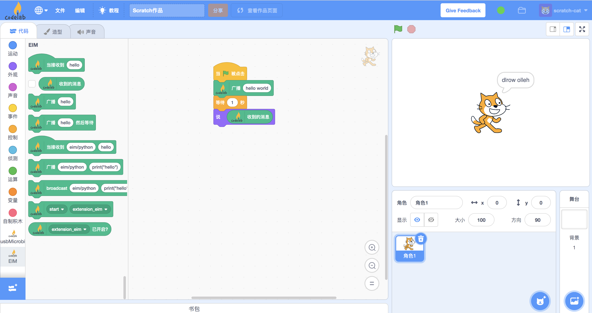

# 编程语言支持
CodeLab Adapter的核心是一个消息系统，它是平台和编程语言无关的，理论上你可以使用任何编程语言来扩展CodeLab Adapter。

我们正在陆续构建多种语言的CodeLab Adapter client。

### nodejs
以下展示如何在nodejs中构建[Adapter Node](/dev_guide/Adapter-Node/)。依然是以反转字符串为例。

首先安装依赖:`npm i codelab_adapter_client_nodejs`, 接着随便找个地方, 创建脚本文件: `hello_world.js`:

```js
const AdapterNode = require('codelab_adapter_client_nodejs');
const ADAPTER_TOPIC = "adapter/extensions/data";

class HelloWorldNode extends AdapterNode {
  constructor() {
    super({
      name: "EIMNode"
    });

    this.num = 0;
    this.receive_loop();
  }

  message_handle(topic, payload) {
    console.log(
      `from scratch: topic: ${topic}, payload: ${JSON.stringify(payload)}`
    );
    const content = payload.content;
    const reverse_content = content
      .split("")
      .reverse()
      .join("");
    const message = {
      topic: ADAPTER_TOPIC,
      payload: { content: reverse_content }
    };
    this.publish_payload(message.payload, message.topic);
  }

  pub_message() {
    this.num += 1;
    const message = { topic: ADAPTER_TOPIC, payload: { content: this.num } };
    this.publish_payload(message.payload, message.topic);
  }

  run() {
  }
}

try {
  m = new HelloWorldNode();
  m.run();
} catch (err) {
  console.log(err);
  process.exit();
}

```

运行CodeLab Adapter（作为消息中心）, 运行我们的拓展: `node hello_world.js`

让我们在[CodeLab Scratch3](https://scratch3v2.codelab.club/)中尝试一下反转字符串:



成功！


### LISP
依赖: `pip install hy`

[hy](http://docs.hylang.org/en/stable/)是一门LISP方言，构建在Python之上，可以使用Python生态里的所有库。于是我们可以很方便地构建Adapter Node: `hello_world.hy`


```lisp
(import codelab_adapter_client)
(import time)

(defclass HelloWorldNode [codelab_adapter_client.AdapterNode]
  "LISP hello world node"

  (defn --init-- [self]
    (.--init-- (super))
    (setv self.EXTENSION_ID  "eim"))

  (defn extension-message-handle [self topic payload]
        (print f"the message payload from scratch: {payload}")
        (setv content (list (get payload "content")))
        (.reverse content)  
        (payload.__setitem__ "content" (.join "" content))
        (print payload)
        (self.publish {"payload" payload})
        )

  (defn run [self]
        (while self._running (time.sleep 1)))
)

(setv node (HelloWorldNode))
(.receive-loop-as-thread node)
(.run node)
```

运行CodeLab Adapter（作为消息中心）, 运行我们的拓展: `hy hello_world.hy`

很多Python内置函数没有写成LISP风格，所以看起来没什么LISP风味，更多Python风味。

### SmallTalk

### Ruby

