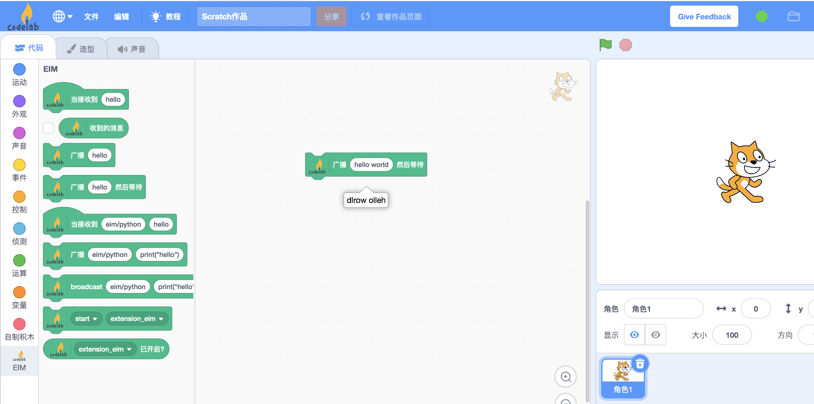

# 同步风格的消息

## 问题
有开发者在[issue](https://github.com/CodeLabClub/codelab_adapter_extensions/issues/38)提了这个问题:

>  怎么处理异步发送的消息，如何等待它成功执行返回?

同步通信的过程可以由下图表示:


如果你熟悉http，就会看出它们是相似的。

如果你熟悉[ROS](https://en.wikipedia.org/wiki/Robot_Operating_System)，可能会觉得，同步模式类似service，异步模式类似action。

## 思路
无论是websocket还是ZeroMQ pub/sub,都是异步的。

我们如何在异步中实现，同步模式呢？策略是使用message_id。 

目前[Scratch eim](https://github.com/CodeLabClub/scratch3_eim/blob/v2/index.js#L290)已经支持同步风格的积木(阻塞风格)。

## 实现
这些同步风格的积木需要与同步风格的CodeLab Adapter插件一起使用。让我们来实现它。

## sync extension
功能依然是反转字符串，在同步插件中，完成反转字符串功能，需要一秒钟。

以下是插件源码:`extension_sync_helloworld.py`

```python
import time
from codelab_adapter.core_extension import Extension


class SyncHelloWorldExtension(Extension):
    def __init__(self):
        super().__init__()
        self.EXTENSION_ID = "eim"

    def send_message_to_scratch(self, payload):
        message = self.message_template()
        message["payload"] = payload
        self.publish(message)

    def extension_message_handle(self, topic, payload):
        self.logger.info(f'the message payload from scratch: {payload}')
        content = payload["content"]
        if type(content) == str:
            content_send_to_scratch = content[::-1] # 反转字符串
            time.sleep(1)
            payload["content"] = content_send_to_scratch
            self.send_message_to_scratch(payload)

    def run(self):
        while self._running:
            time.sleep(1)

export = SyncHelloWorldExtension
```

通过与[hello world教程](/dev_guide/helloworld/)的对比，可以看出同步消息与异步消息在CodeLab Adapter插件一侧的区别: 通过返回来自Scratch的消息中携带的message_id(message_id在payload中，通过观察日志，可以看到payload内部细节)。让请求者得知当前消息被响应了。

同步消息与异步消息，在scratch插件一侧的区别表现为不同的积木（是否`wait/等待`），js代码层面的差异表现在:[发送消息的函数不同](https://github.com/CodeLabClub/scratch3_eim/blob/v2/index.js#L290), 这部分你可以直接使用eim插件，可以不做深究。

刷新Web UI，点击运行`extension_hello_world.py`. 接着你就可以在Scratch中与你的插件交互了。



如果你将5个上图中的积木拼在一起，它们将依次运行，一共耗时5秒。

## FAQ
如果某个积木，在wait的过程中，没有得到响应会发生什么？

超时时间是5秒，所以5秒后会继续往下运行。


# 参考:
*  [codelab-adapter与应答模式](https://blog.just4fun.site/codelab-adapter-req-rep.html)