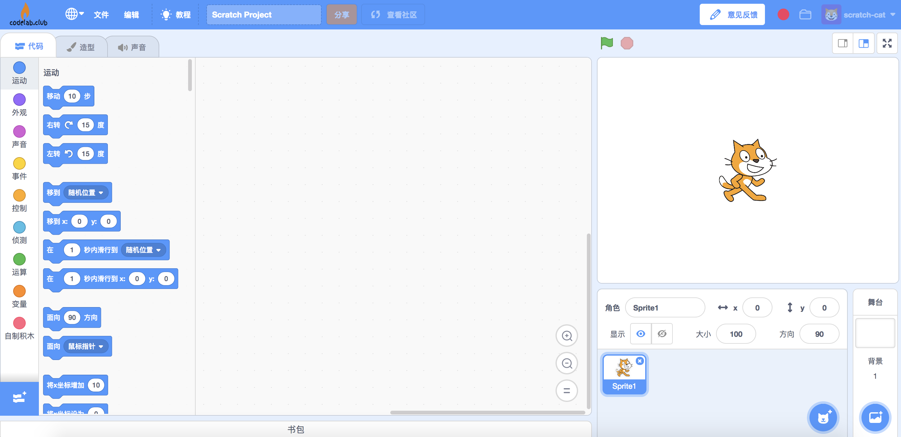

# ROS
### 步骤 1：打开 CodeLab Scratch
下载 [CodeLab Scratch Desktop（离线版）](https://www.codelab.club/blog/2020/08/20/tools)，并运行它。

ps: 要求 CodeLab Scratch Desktop >= 1.2.1

### 步骤 2：运行 ROS
运行 ROS。

### 步骤 3：运行桥接程序
运行桥接程序。

### 步骤 4：开始使用
选择 scratch3 中的 ROS 插件：

开始使用。

<video width=80% src="/video/rrf_ros.MP4" controls="controls"></video>
