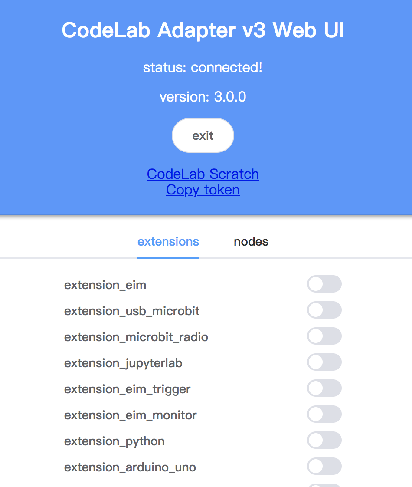

# Tutorial
系统依赖参考 [EIM 教程](/extension_guide/eim/)。

### 安装依赖

我的环境是：`MacOS blender 2.8`

```bash
cd /Applications/blender.app/Contents/Resources/2.80/python/bin
wget https://bootstrap.pypa.io/get-pip.py
./python3.7m ./get-pip.py --prefix /Applications/blender.app/Contents/Resources/2.80/python
./python3.7m pip3 install codelab_adapter_client
```

### 在 blender 中运行 [blender_server](https://github.com/CodeLabClub/codelab_adapter_extensions/blob/master/servers_v2/blender_server.py)

在 blender 中运行 [blender_server.py](https://github.com/CodeLabClub/codelab_adapter_extensions/blob/master/servers_v2/blender_server.py)，我们在 blender 2.79 和 2.80 两个版本中都做了测试。

在 blender 2.79b 中， 打开`Text Editor`，运行 [blender_server.py](https://github.com/CodeLabClub/codelab_adapter_extensions/blob/master/servers_v2/blender_server.py)：


在 blender 2.80 中，我喜欢打开 `Scripting` 标签页（使用 Text Editor 也可以），运行 [blender_server.py](https://github.com/CodeLabClub/codelab_adapter_extensions/blob/master/servers_v2/blender_server.py)：


### 在 CodeLab Adapter 运行 [extension_blender.py](https://github.com/CodeLabClub/codelab_adapter_extensions/blob/master/extension_blender.py) 插件



下载`https://github.com/CodeLabClub/codelab_adapter_extensions/blob/master/extensions_v2/extension_blender.py`插件。

下载完成后，刷新 CodeLab Adapter Web UI，或者手动将其放到插件目录。

### 开始使用

打开 [CodeLab Scratch3](https://scratch3v2.codelab.club/)，开始使用。

<video width=600px src="/video/blender.mp4" controls="controls"></video>

如果遇到问题，请尝试刷新浏览器缓存。

# todo

将 [blender_server](https://github.com/CodeLabClub/codelab_adapter_extensions/blob/master/servers_v2/blender_server.py) 写成  blender 插件。
