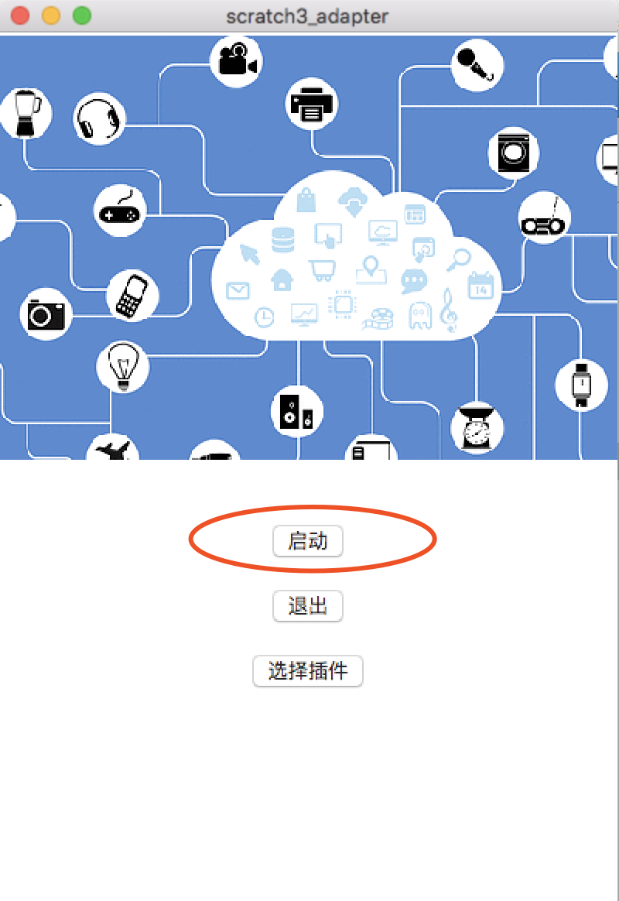

# Cozmo
[Cozmo社区](https://forums.anki.com)有好几个帖子在讨论能否让Cozmo在电脑上运行，诸如[Run code Lab on computer?](https://forums.anki.com/t/run-code-lab-on-computer/10473)

Cozmo社区里有人尝试使用blockly在电脑里控制cozmo:[cozmo-blockly](https://github.com/maxosprojects/cozmo-blockly)。源码比较复杂，我之前在Mac上一直无法成功run起来(在Windows下倒是成功了)

使用scratch3_adapter，我们可以轻松将Cozmo接入scratch3.0中

## 原理
为了让电脑连上Cozmo，我们需要利用Cozmo官方发布的[Cozmo Python SDK](https://github.com/anki/cozmo-python-sdk),具体的配置方法官方已经给出:[Initial Setup](http://cozmosdk.anki.com/docs/)，根据你的手机和电脑的不同，做相应配置

在继续阅读操作之前，先确保把官方[hello world的demo](http://cozmosdk.anki.com/docs/getstarted.html#first-steps-hello-world) run起来

## 使用插件
前三个步骤和[micro:bit](/user_guide/usage/)完全相同，依次为:

### 步骤1: 打开Scratch3 Lab
推荐使用[Chrome浏览器](https://www.google.cn/chrome/index.html)点击打开[Scratch3 Lab](https://scratch3-lab.just4fun.site/)，目前Scratch官方团队在目录支持更多浏览器版本，现阶段使用Chrome浏览器效果最佳

目前Scratch3 Lab的服务器在香港，第一次加载，你需要耐心等待一段时间(之后打开就快了)


### 步骤2: 打开scratch3_adapter
双击打开scratch3_adapter，点击启动



### 步骤3: https检验(只需要验证一次)
如果你是第一次使用scratch3_adapter，则需要点击scratch3_adapter菜单栏中的`https检验`


在自动打开的页面里依次点击`高级 > 继续前往127.0.0.1（不安全）`


### 步骤4: 运行cozmo server
[cozmo server](https://github.com/Scratch3Lab/scratch3_adapter_extensions/blob/master/src/cozmo_server.py)是一个独立的进程，打开一个命令行窗口把它run起来(依赖于[Cozmo Python SDK](https://github.com/anki/cozmo-python-sdk)，建议就在你刚才运行[hello world的demo](http://cozmosdk.anki.com/docs/getstarted.html#first-steps-hello-world)的地方运行它)

```
wget https://raw.githubusercontent.com/Scratch3Lab/scratch3_adapter_extensions/master/src/cozmo_server.py
python cozmo_server.py
```

ps: 架构层面，尽管我们也可以在extension_cozmo中直接控制cozmo。但scratch3_adapter基于zeromq，在zeromq的世界里，鼓励创建连接程序的管道,而不是使用多线程把他们揉在一起。这种方式轻便灵活，多个进程之间使用消息而不是锁来协同。我们已经爱上了这种风格：）

### 步骤5:  加载scratch3_adapter的cozmo插件


### 步骤6:  在scratch3 lab运行积木!

选择对应的scratch3插件: Cozmo


接着选择积木，点击运行


### 后记
由于时间有限，我们目前只为cozmo制作了几个积木块(和官方`code lab`中的几乎一模一样!)，如前头说的，如果你愿意，你可以自行扩展它，将cozmo更多的技能包装为积木，时间充裕的话，完全能够做到和官方的app一样丰富！