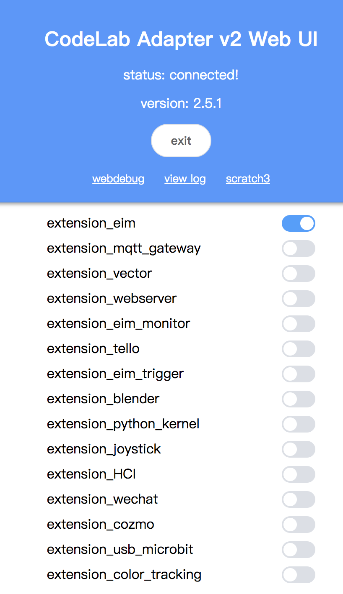
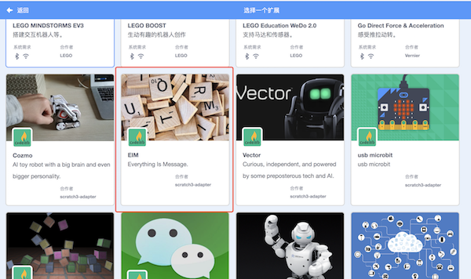
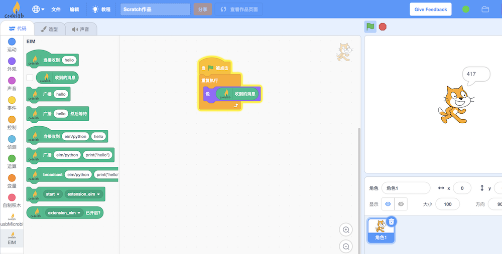

# Tutorial

## 依赖

{!utils/dependence.md!}

## 步骤 1：打开 Codelab Adapter

{!utils/open_adapter.md!}

## 步骤 2：打开 Codelab Scratch3

{!utils/open_scratch.md!}

## 步骤 3：加载 EIM 插件

在 Web UI 中点击加载 EIM 插件:

eim 每秒钟更新一次数值，将数值报告给 Scratch3。

## 步骤 4：hello world

选择对应的 Scratch3 插件：EIM

我们可以让 Scratch3 的角色读出 EIM 每秒更新一次的数值：

