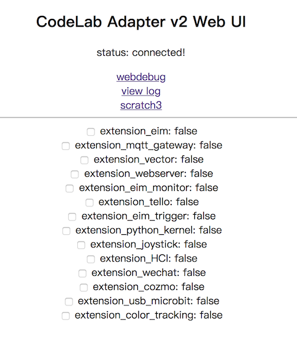
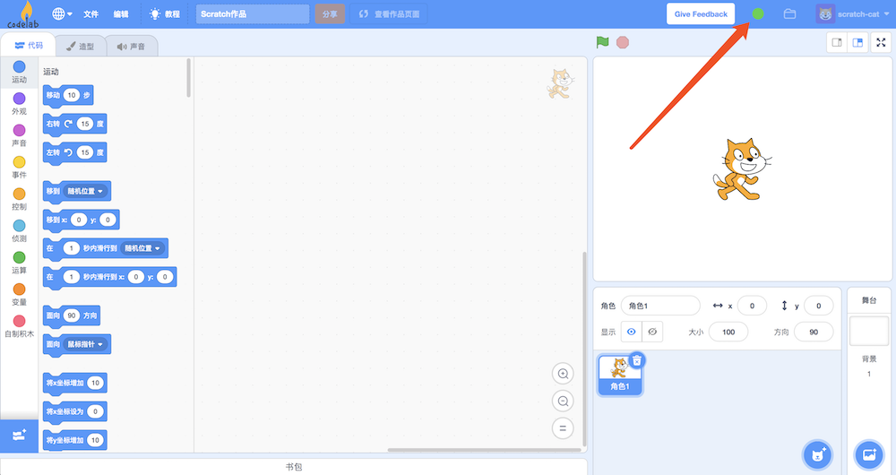
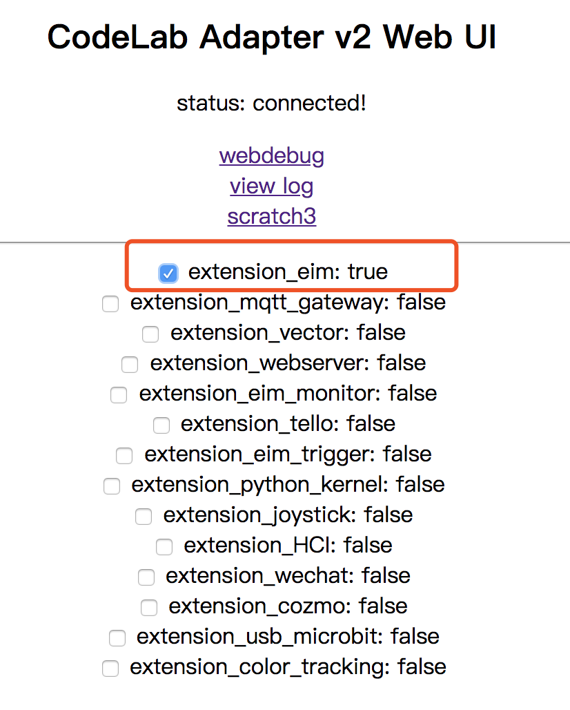

# Tutorial

<!--todo 依赖 - 步骤2 抽象成模版-->

{!utils/dependence.md!}

### 步骤 1: 打开 Codelab Adapter

双击打开 Codelab Adapter。

Codelab Adapter 启动之后，将打开默认浏览器(建议将 Chrome 设为默认浏览器)。

### 步骤 2: 打开 Codelab Scratch3

点击 Web UI 上的`scratch3`链接, 将打开如下页面:

图中箭头所指的小圆点呈现绿色说明 Codelab Adapter 与 Scratch3.0 的连接正常。

### 步骤 3: 加载eim插件
在 CodeLab Adapter 中点击加载 eim 插件:

eim每秒钟更新一次数值，将数值报告给Scratch3.

### 步骤 4: hello world

选择对应的 Scratch3 插件: EIM 

我们可以让Scratch3的角色读出EIM每秒更新一次的数值:

