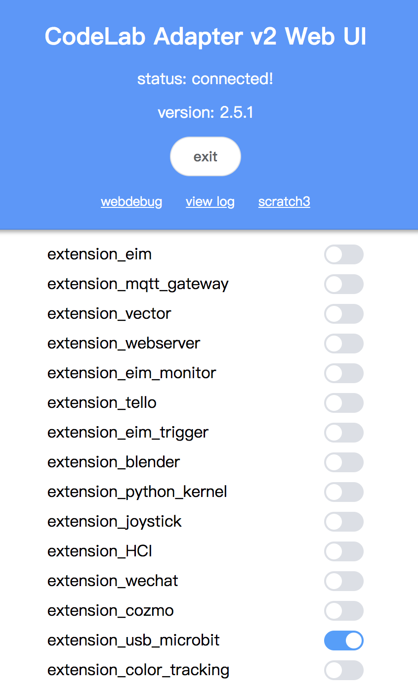

# Tutorial

## 依赖

{!utils/dependence.md!}

## 步骤 1：打开 Codelab Adapter

{!utils/open_adapter.md!}

## 步骤 2：打开 Codelab Scratch3

{!utils/open_scratch.md!}

<!--
### 步骤3: https检验（只需要验证一次）
如果你是第一次使用 scratch3_adapter，则需要点击 scratch3_adapter 菜单栏中的 `https 检验`

在自动打开的页面里依次点击`高级 > 继续前往 127.0.0.1（不安全）`

完成之后，scratch3_adapter 就可以与 CodeLab Scratch3 建立连接了
-->

## 步骤 3：连接 micro:bit，加载插件

使用数据线将 micro:bit 接入电脑，下载 <a href="../../img/usb_Microbit_frimeware.hex" target="_blank">usb_Microbit_frimeware.hex</a> 右键保存到本地，并将保存的文件拖入 micro:bit 中。

ps: Windows 7 用户注意（Mac 和 Windows 10 用户可以跳过），为了能发现并连接 micro:bit，需要[安装驱动](../../img/mbedWinSerial_16466.exe)（和使用 mu-editor 操作相同）

完成后在 CodeLab Adapter 中点击加载 usb micro:bit 插件:

你应该看到 micro:bit 背后的信号灯高频闪烁，如果它没有高频闪烁，则按一下 micro:bit 背部的复位按钮

ps: linux 用户注意，scratch3_adapter 使用 usb 串口与 micro:bit 连接，linux 下，使用 usb 串口需要做权限设置：`sudo chmod 666 /dev/ttyACM0`

## 步骤 4：hello world

现在让我们利用 Scratch3 控制 micro:bit，让它在点阵屏上打印 `hello world`

选择对应的 Scratch3 插件：usb microbit。

选择对应拓展积木，点击运行

## 结语

这个例子完整展示了 CodeLab Adapter 的使用流程

- 打开 CodeLab Adapter
- 打开 CodeLab Scratch3
- 接入你的设备（可以是任何开源硬件）
- 打开对应插件
- 选择对应拓展积木，在 Scratch 3.0 中与设备交互

如果你想接入的设备目前没有默认插件支持它，你可以自己来写，CodeLab Adapter 允许你将任何硬件接入 scratch 3.0 中，别害怕，需要的代码很少也很简单，详情参见[开发手册](/dev_guide/helloworld/)。我们支持使用任何编程语言来写拓展，目前我们自己主要使用 Python。

我们也将在 [extension guide](/extension_guide/introduction/) 中介绍各种社区插件的使用方法。
