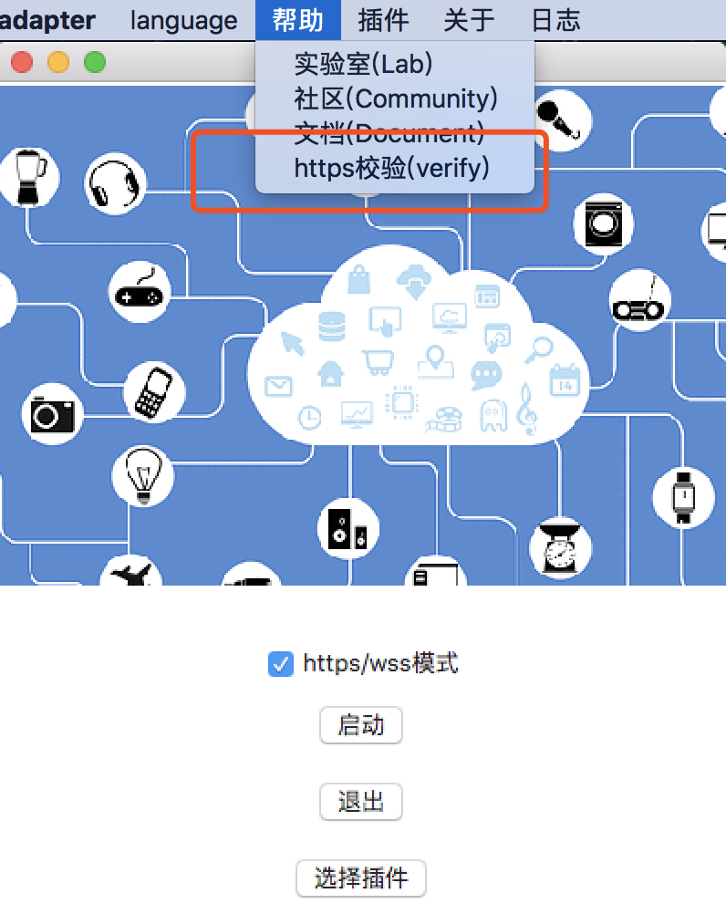
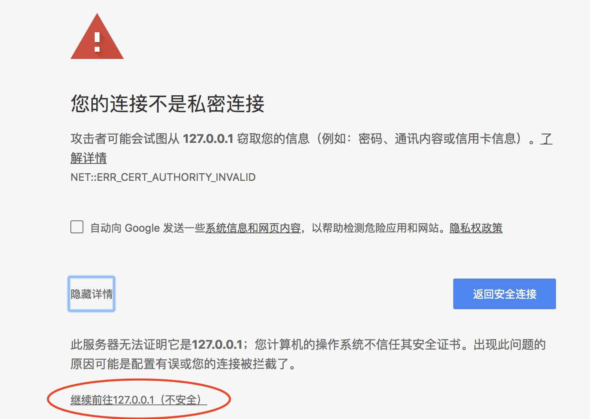
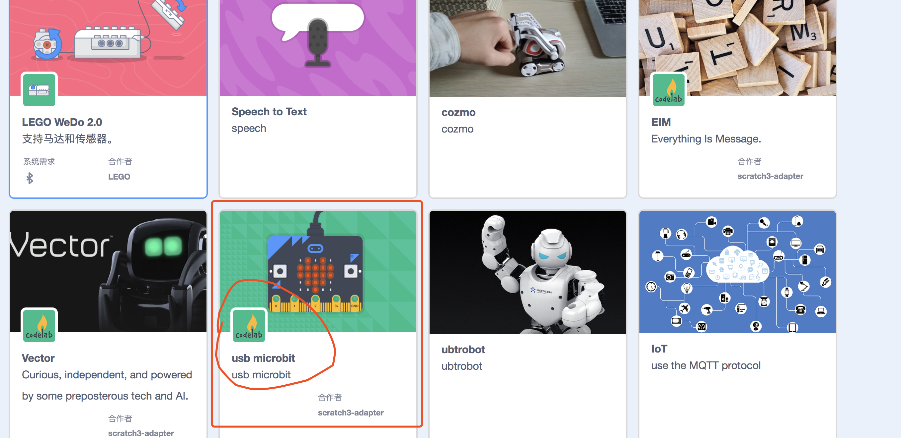
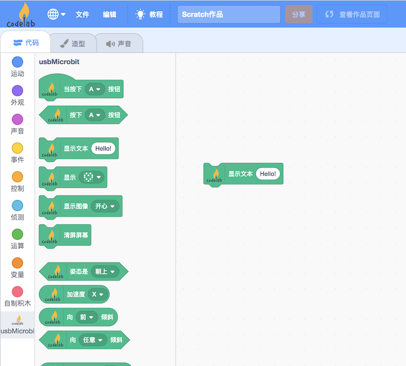

# Tutorial

<!--
!!! 提醒
    microbit v2 用户，请使用这个[固件](/hex/usb_Microbit_firmware_4v1v2.hex)。目前需要手动刷新，Adapter的下个版本(4.2.1)我们将提供更好的支持。-->

!!! 提醒
    [microbit radio插件](/extension_guide/microbit_radio/)与 [usb microbit插件](/extension_guide/microbit/)最好不要同时使用.  

!!! 规划
    我们计划迁移到[bitio](https://github.com/whaleygeek/bitio)上，这个项目将方便用户在 Python 中与 microbit 交互。欢迎社区用户参与开发版本插件。

## 依赖

{!utils/dependence.md!}

## 步骤 1：打开 Codelab Adapter

{!utils/open_adapter.md!}

## 步骤 2：打开 Codelab Scratch3

{!utils/open_scratch.md!}

<!--
### 步骤3: https检验（只需要验证一次）
如果你是第一次使用 scratch3_adapter，则需要点击 scratch3_adapter 菜单栏中的 `https 检验`

在自动打开的页面里依次点击`高级 > 继续前往 127.0.0.1（不安全）`

完成之后，scratch3_adapter 就可以与 CodeLab Scratch3 建立连接了
-->

## 步骤 3：连接 micro:bit，加载插件

使用数据线将 micro:bit 接入电脑。

ps: Windows 7 用户注意，为了能发现并连接 micro:bit，需要[安装驱动](../../img/mbedWinSerial_16466.exe)（和使用 mu-editor 操作相同）

在 CodeLab Adapter 中点击加载 usb micro:bit 插件:

<!-- -->

如果你是第一次连接，会自动烧录固件（背面LED灯快速闪烁）。刷完之后，重新连接，连接之后，你应该看到 micro:bit 背后的信号灯高频闪烁，如果它没有高频闪烁，则按一下 micro:bit 背部的复位按钮

ps: linux 用户注意，scratch3_adapter 使用 usb 串口与 micro:bit 连接，linux 下，使用 usb 串口需要做权限设置：`sudo chmod 666 /dev/ttyACM0`

!!! 提醒
    如果你遇到问题，可手动烧录[固件(v1)](/hex/usb_Microbit_firmware.hex)(保存文件到本地，并拖到 Microbit盘里)。 microbit v2 用户，请使用这个[固件](/hex/usb_Microbit_firmware_4v2.hex)

## 步骤 4：hello world

现在让我们利用 Scratch3 控制 micro:bit，让它在点阵屏上打印 `hello world`

选择对应的 Scratch3 插件：usb microbit。

选择对应拓展积木，点击运行

## 结语

这个例子完整展示了 CodeLab Adapter 的使用流程

- 打开 CodeLab Adapter
- 打开 CodeLab Scratch3
- 接入你的设备（可以是任何开源硬件）
- 打开对应插件
- 选择对应拓展积木，在 Scratch 3.0 中与设备交互

如果你想接入的设备目前没有默认插件支持它，你可以自己来写，CodeLab Adapter 允许你将任何硬件接入 scratch 3.0 中，别害怕，需要的代码很少也很简单，详情参见[开发手册](/dev_guide/helloworld/)。我们支持使用任何编程语言来写拓展，目前我们自己主要使用 Python。

我们也将在 [extension guide](/extension_guide/introduction/) 中介绍各种社区插件的使用方法。

!!! 
    [usb_Microbit_firmware.hex的源码](https://github.com/CodeLabClub/codelab_adapter_extensions/blob/master/firmware/usb_Microbit_firmware_hex.py)。 采用[python.microbit.org](https://python.microbit.org/v/2.0)生成hex

# FAQ
## MacOS 10.15 无法使用
MacOS 用户 @patch 提到 MacOS 10.15 以后启用了SIP（System Integrity Protection系统完整性保护），程序对系统目录无法直接访问了。所以flashing new firmware 时报operation not permitted的错误就是这个问题导致的。  
关掉系统的SIP以后再测试，flashing new firmware这一步成功了

## 反复刷入固件
建议拔掉microbit，再重新插入电脑

## 第一次刷入固件
目前有个bug，插拔microbit之后，可能会重新刷入固件。原因似乎是复合的，应该与node和固件（可以使用https://python.microbit.org/v/2加载固件）都有关，这两部目前都是开放的，欢迎大家修复
