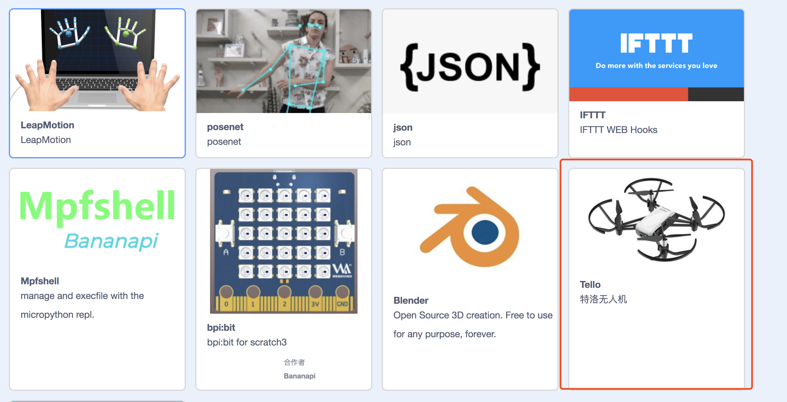

# DJI Tello(Edu)

!!! 提醒
    Tello会占用wifi，导致电脑无法联网，需要使用CodeLab Adapter的离线模式: [FAQ:离线使用](https://adapter.codelab.club/user_guide/FAQ/#_6)

在[codelab-adapter](https://adapter.codelab.club/user_guide/install/)最新版本中, 已经内置了Tello插件。

### 步骤1: 打开CodeLab Scratch
下载[CodeLab Scratch Desktop(离线版)](https://www.codelab.club/blog/codelab-download/)， 并运行它。

ps: 要求 CodeLab Scratch Desktop >= 1.2.0

### 步骤2: 连接Tello
将电脑连上Tello的wifi热点。操作细节可以参考Tello说明书。

### 步骤3: 启动codelab-adapter
双击启动codelab-adapter。

看到[CodeLab Scratch](https://scratch3v2.codelab.club/)指示灯显示绿色,代表连接成功。

### 步骤4: 开始使用
使用EIM插件中的积木打开Tello插件

选择scratch3中的Tello插件: 

起飞吧！

# 一些案例:

## DJI Tello x Leap Motion
<video width=300px src="http://scratch3-files.just4fun.site/tello_leapmotion.mp4" controls="controls"></video>

## DJI Tello x Switch Labo
<video width=300px src="http://scratch3-files.just4fun.site/tello_labo.mp4" controls="controls"></video>

## DJI Tello x Switch Joy-Con
<video width=300px src="http://scratch3-files.just4fun.site/tello_joy_con.mp4" controls="controls"></video>

