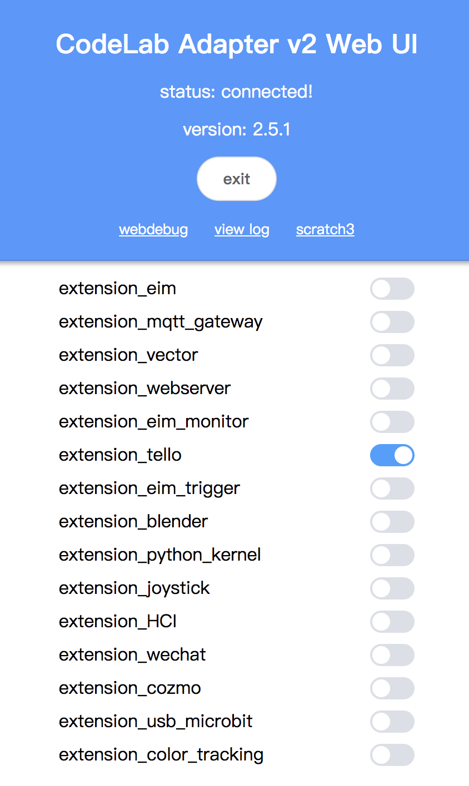
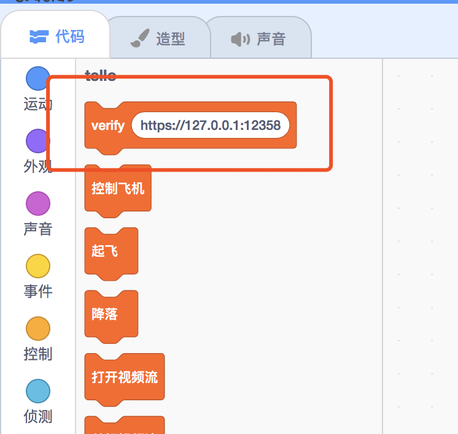

# DJI Tello(Edu)
在[codelab-adapter](https://adapter.codelab.club/user_guide/install/)最新版本中, 已经内置了Tello插件。

### 步骤1: 打开CodeLab Scratch
推荐使用[Chrome浏览器](https://www.google.cn/chrome/index.html)点击打开:[https://scratch3v2.codelab.club/?adapter_host=127.0.0.1](https://scratch3v2.codelab.club/?adapter_host=127.0.0.1)

### 步骤2: 连接Tello
将电脑连上Tello的wifi热点。操作细节可以参考Tello说明书。

### 步骤3: 启动codelab-adapter，加载插件
双击启动codelab-adapter。

点击加载Tello插件

### 步骤4: 开始使用
选择对应的scratch3插件: Tello

点击验证:

确认连接的安全性:

片刻，可以看到[CodeLab Scratch](https://scratch3v2.codelab.club/)指示灯显示绿色,代表连接成功。

起飞吧！

# 一些案例:

## DJI Tello x Leap Motion
<video width=300px src="http://scratch3-files.just4fun.site/tello_leapmotion.mp4" controls="controls"></video>

## DJI Tello x Switch Labo
<video width=300px src="http://scratch3-files.just4fun.site/tello_labo.mp4" controls="controls"></video>

## DJI Tello x Switch Joy-Con
<video width=300px src="http://scratch3-files.just4fun.site/tello_joy_con.mp4" controls="controls"></video>

