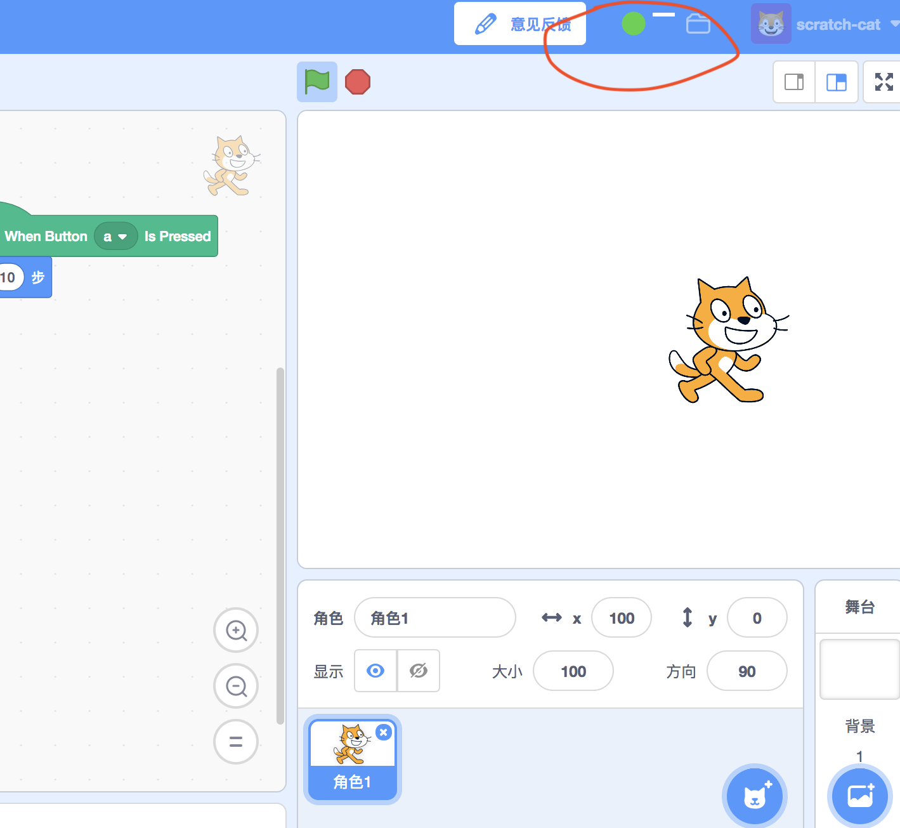

# DJI Tello（Edu）

!!! 提醒
    Tello 会占用 wifi，导致电脑无法联网，需要使用 CodeLab Adapter 的离线模式：[FAQ：离线使用](/user_guide/FAQ/#_6)

在[codelab-adapter](/user_guide/install/)最新版本中, 已经内置了Tello插件。

### 步骤 1：打开 CodeLab Scratch
下载 [CodeLab Scratch Desktop(离线版)](https://www.codelab.club/blog/codelab-download/)，并运行它。

ps: 要求 CodeLab Scratch Desktop >= 1.2.0

### 步骤 2：连接 Tello
将电脑连上 Tello 的 wifi 热点。操作细节可以参考 Tello 说明书。

### 步骤 3：启动 codelab-adapter
双击启动 codelab-adapter。

看到 [CodeLab Scratch](https://scratch3v3.codelab.club/) 指示灯显示绿色，代表连接成功。

### 步骤 4：开始使用
使用 EIM 插件中的积木打开 Tello 插件。

选择 scratch3 中的 Tello 插件：

起飞吧！

# 一些案例:

## DJI Tello x Leap Motion
<video width=300px src="/video/tello_leapmotion.mp4" controls="controls"></video>

## DJI Tello x Switch Labo
<video width=300px src="/video/tello_labo.mp4" controls="controls"></video>

## DJI Tello x Switch Joy-Con
<video width=300px src="/video/tello_joy_con.mp4" controls="controls"></video>

