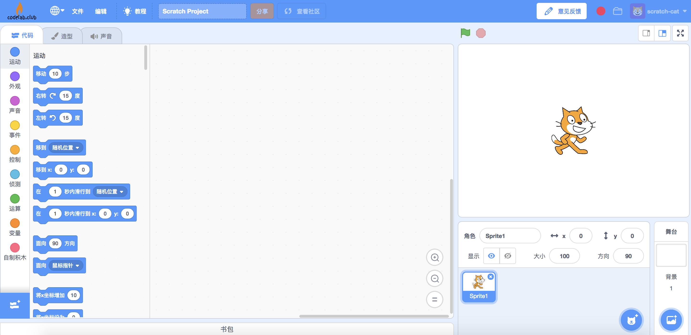

# Tello 2.0

Tello 插件的 2.0 版本， 基于[DJITelloPy](https://github.com/damiafuentes/DJITelloPy)库。

支持Tello、Tello Edu 和 Tello TT。

!!! 提醒
    Tello 会占用 wifi，导致电脑无法联网，请使用 CodeLab Adapter 的离线模式: [FAQ：离线使用](/user_guide/FAQ/#_6) (在`>=3.4.0`的版本中可用)。  
    更好的方式可能是将Tello接入路由器上，或者使用USB无线网卡，避免电脑无法上网。

以下是在线版使用教程，离线版基本相似。

### 步骤 1：打开 [CodeLab Scratch](https://scratch-beta.codelab.club)
运行CodeLab Adapter， 确保在线平台与Adapte连接正常。

看到 [CodeLab Scratch](https://scratch-beta.codelab.club) 指示灯显示绿色，代表连接成功。

<!--
下载 [CodeLab Scratch Desktop(离线版)](https://www-old.codelab.club/blog/2020/08/20/tools/)，并运行它。

-->

### 步骤 2：连接 Tello

将电脑连上 Tello 的 wifi 热点。（操作细节可以参考 Tello 说明书）

### 步骤 3：开始使用

选择 scratch3 中的 Tello2.0 插件.

<!---->

运行 Tello2.0 插件。

<!---->

之后依次点击 `连接tello` 、 `起飞`

<!---->

起飞吧！

# 一些案例:

## DJI Tello x Leap Motion

<video width=300px src="/video/tello_leapmotion.mp4" controls="controls"></video>

## DJI Tello x Switch Labo

<video width=300px src="/video/tello_labo.mp4" controls="controls"></video>

## DJI Tello x Switch Joy-Con

<video width=300px src="/video/tello_joy_con.mp4" controls="controls"></video>

## 进阶
你可以在 Tello 广播积木里调用 [api](https://djitellopy.readthedocs.io/en/latest/tello/)！形如: [tello.flip_left()](https://djitellopy.readthedocs.io/en/latest/tello/#djitellopy.tello.Tello.flip_left)

利用API，你也可以与停机坪(机器视觉)交互([get_mission_pad_id](https://djitellopy.readthedocs.io/en/latest/tello/#djitellopy.tello.Tello.get_mission_pad_id)).API里有很多与停机坪相关的函数。

如果你希望做一些更复杂的事，建议直接使用社区里的 [DJITelloPy](https://github.com/damiafuentes/DJITelloPy) 与 设备交互（[api](https://djitellopy.readthedocs.io/en/latest/tello/)），之后使用 [Adapter Node](https://adapter.codelab.club/dev_guide/Adapter-Node/) 将其接入Adapter环境中。

## Tello api 文档
*  [DJITelloPy](https://github.com/damiafuentes/DJITelloPy)
*  [SDK 2.0](https://dl-cdn.ryzerobotics.com/downloads/Tello/Tello%20SDK%202.0%20User%20Guide.pdf)

<!--
*  [TelloPy](https://github.com/hanyazou/TelloPy)
*  [Tello-Python](https://github.com/dji-sdk/Tello-Python)
-->

*  [multi_robot_drone_example](https://robomaster-dev.readthedocs.io/zh_CN/latest/python_sdk/multi_robot_drone_example.html)

    