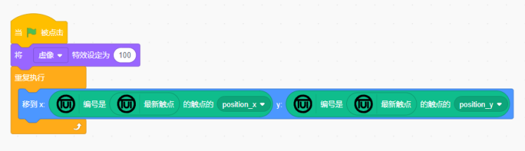
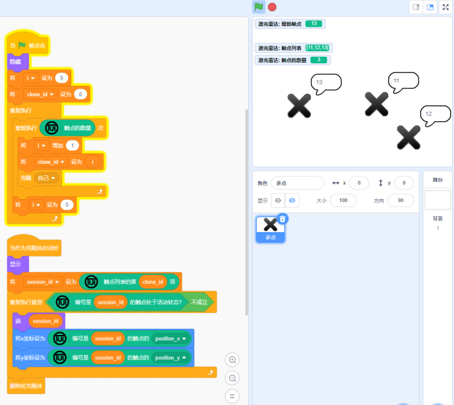

# 激光雷达

激光雷达积木是一种在Scratch舞台上创建交互式触摸作品的积木块，将房间变成 Scratch 舞台区，你可以使用身体与Scratch进行互动！
## 使用说明
使用前，我们需要准备好激光雷达和投影仪并进行校准，校准之后的投影区域与舞台区域坐标保持一致，x、y坐标与Scratch中的x、y坐标概念相同，也是触点中最常用的数据。当你站在Scratch舞台上时，下面的积木块可以让角色跟随你的脚移动。

积木中触点的概念类似于Scratch中的鼠标指针，与鼠标指针不同的是，激光雷达积木可以让Scratch舞台区具有多点触控的能力，并且都是由你编程实现的！使用时，一种好的做法是将触点的数据映射为Scratch中的一个角色，这个角色可以得到Scratch中其他积木块的能力，如碰撞侦测。如果不想在舞台上看到角色，可以让角色在舞台上透明。

当触点数据包含了多个触点时，使用触点列表积木可以看到全部的触点，最新触点积木会看到最新加入的触点。
如果只想关注触点列表中的某一个触点，我们也给出了根据下标获得触点的积木。

触点拥有自己的生命，如果使用Scratch中的克隆来完成多点触控的代码，每一个触点都是一个克隆体，当触点不再处于活动状态时，最好删除这个克隆体。

!!! tips
    多点触控的代码虽然可以复用，但写法并不是唯一的。想象一下你是作品的交互设计师，可以让代码去适应你独特的交互逻辑。

## Demo视频
[交互激光雷达](https://adapter.codelab.club/extension_guide/lidar/)
## 更多作品
[雷达互动作品工作室](https://create.codelab.club/studios/378)
