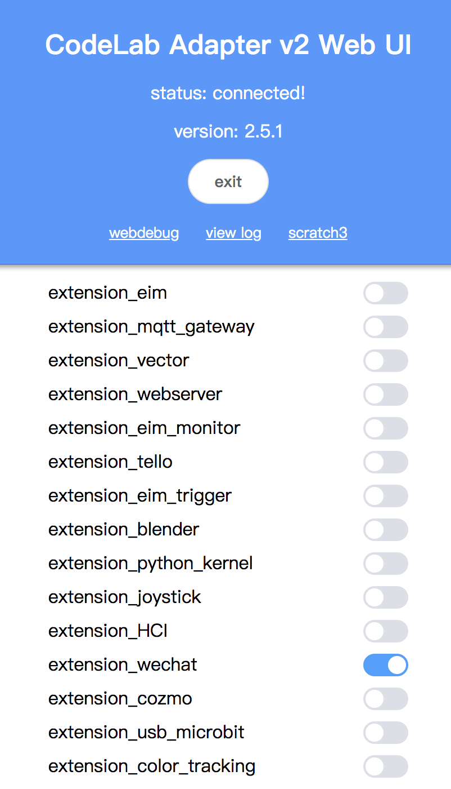
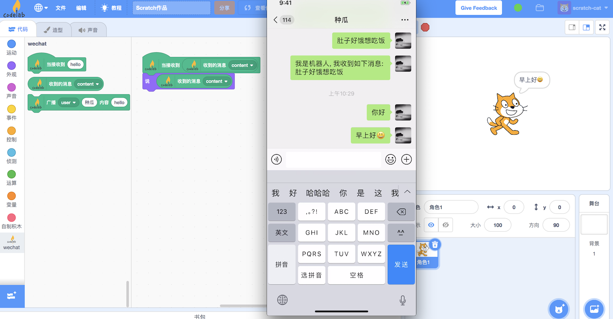

# Tutorial

## 依赖

{!utils/dependence.md!}

## 步骤 1: 打开 Codelab Adapter

{!utils/open_adapter.md!}

## 步骤 2: 打开 Codelab Scratch3

{!utils/open_scratch.md!}

## 步骤 3: 加载 CodeLab Adapter 微信插件

<!--

-->

在 Web UI 中点击加载 `extension_wechat` 插件:

插件运行后，会弹出二维码，用微信扫码即可登陆。

## 在 Scratch3.0 中使用微信插件

# 演示

<video width=80% src="http://scratch3-files.just4fun.site/wechat_extension.mp4" controls="controls"></video>
