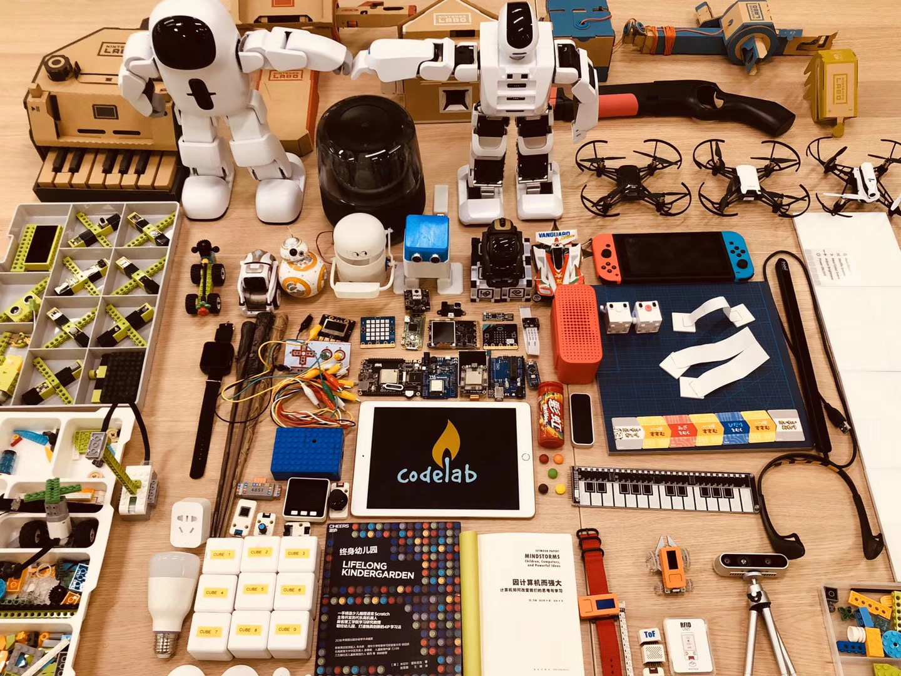

# CodeLab Adapter

> Turn the world into your playground!

## 是什么？

CodeLab Adapter 是一个由 Python 构建的软件(构建在消息之上(`Everything Is a Message`))， 致力于连接万物，无论是软件还是硬件，无论是 AI、开源硬件、现实世界的物体、还是虚拟世界的动画角色，接入 CodeLab Adapter，皆可彼此互动。

在 CodeLab Adapter 驱动的环境里，通过使用 Scratch 或 Python 编程，你可以与万物沟通: 你可以在朋友生日那天，在 Ta 进门的一刻，将手中的魔杖一挥，在空中划一个字母 L 的轨迹，瞬间，点亮房间里五彩的灯光。 <!--你可以让环境识别出你的运动，进而制作一个体感游戏, 或是让整个空间变得智能。-->

具体请看下面两个演示案例：

<video width=80% src="/video/IMG_0657_1598435455275317.mp4" controls="controls"></video>

在上方视频中, 我们做了一场魔法烟花秀: 请看视频左侧，当挥动手中的魔杖实施第一个魔法，时间被冻结，视频右侧烟花静止在空中；实施第二个魔法，将烟花"解冻"; 实施第三个魔法-- 百花齐放。 Adapter 负责将烟花(虚拟)与魔杖(实物)连接在一起，用户在一个[创作平台](https://create.codelab.club/projects/editor)中即可同时操控两者，演绎自己编写的故事。

<!--阐述它
Adapter里干了啥

在上述的例子中

假设 你是Scratch用户

如果之前接触过编程(诸如Python)
-->

<video width=80%  src="/video/%E8%AF%BB%E4%B9%A6%E4%B8%8E%E6%80%9D%E8%80%83.mp4" controls="controls"></video>

上方第二个视频演示了如何构建一个 **理解** 你当前处境的 AI，当你正在阅读时，AI 将为你把灯打开；当你合上书，AI 将为你把灯关掉，让你沉浸在黑暗中思考。 Adapter 负责接入外部 AI 与现实空间内的智能灯具，辅助你在[创作平台](https://create.codelab.club/projects/editor)中通过编程控制他们。

下面请看案例集锦视频，更多的在[这里](https://codelab.club/projects)。

<!--综合案例-->

<video width=80% src="https://scratch3-files.just4fun.site/CodeLabVideos3_5m.mp4" controls="controls"></video>

<!--
CodeLab Adapter 的一个典型用例，是将任何有趣的东西接入 Scratch 3.0，接入之后你便能用 Scratch 3.0 的积木来操控它，让它与任何接入 Scratch 3.0 的物体互动。无论是来自现实世界的物体，还是来自虚拟世界的 AI 或动画角色，都能彼此互动，我们不想针对某个硬件产品发布一个客户端，我们相信创意来自广泛的连接，我们致力于做一个中立的东西，将 Scratch 3.0 连接到更广阔的领域，我们想做到[宽围墙](http://learn.media.mit.edu/lcl/weeks/week5/)。
-->

<!--todo 视频-->

## 能做什么？

CodeLab Adapter 的典型用途包括:

-   扩展 Scratch 的能力（[比 Scratch Link 更强大](/user_guide/FAQ/#scratch-link)）  
    为它接入 AI、IoT、开源硬件、始就玩起来实物、虚拟角色...使Scratch成为酷上加酷的[创作平台](https://create.codelab.club/projects/editor)
-   Python 入门  
    Adapter 由 Python 构建，对 Scratch 的增强也是通过使用 Python 写的插件实现。因此，Python 入门者通过简单修改现成插件代码为己所用、或编写新的插件代码，即可快速上手玩起来
-   [构建可编程空间](https://codelab.club/blog/2020/04/29/%E5%8F%AF%E7%BC%96%E7%A8%8B%E7%A9%BA%E9%97%B4/)
-   [构建 Dynamic Table](https://codelab.club/blog/2020/05/31/DynamicTable/)
-   扩展在线编程平台(Blockly 等)的能力

## 特性有哪些？

-   开放
-   高度可扩展
    -   [插件(Extension)](/dev_guide/helloworld/) 和 [节点(Node)](/dev_guide/Adapter-Node/)
-   万物皆消息(EIM, Everything Is a Message)
-   RESTful API
-   支持多门编程语言(34+)
-   将 Scratch 和 Python 视为一等公民

<!--看两个视频-->

<!--

CodeLab Adapter 是一个跨平台跨语言的通用工具，你可以在多个平台上,将多种编程语言作为它的 client， 详情参考[Architecture](/dev_guide/Architecture/)。除了 Scratch 3.0，CodeLab Adapter 目前也支持 Blockly、Python、JavaScript、SmallTalk，更多的编程语言支持目前还在开发中。

以下是一些接入列表:

### 硬件相关

-   [micro:bit](http://microbit.org/)
-   [Arduino](https://www.arduino.cc/)
-   [Cozmo](https://www.anki.com/en-us/cozmo)
-   [Vector](https://www.anki.com/en-us/vector)
-   [BB8](https://store.sphero.com/products/bb-8-by-sphero)
-   [树莓派](https://www.raspberrypi.org/)
-   [智能家居](https://blog.just4fun.site/scratch3-smart-home.html)
-   [Switch Labo](https://labo.nintendo.com/)
-   [Switch Joy-Con](https://www.nintendo.com/switch/)
-   四轴飞行器
    -   [Parrot](http://www.parrot.com.cn) 的 3 个型号
    -   DJI Tello
-   [优必选 Alpha 系列机器人](https://www.ubtrobot.com/cn/products/e-bot/)
-   Leju Robot
    -   Pando
    -   Aelos
-   脑电波传感器
-   掌控板
-   眼动仪
-   ...

### AI 相关

-   [微软认知服务](https://azure.microsoft.com/zh-cn/services/cognitive-services/)
-   [本地化的机器视觉](https://js.tensorflow.org/)
-   [OpenCV](https://opencv.org/)
-   [TensorFlow](https://github.com/tensorflow/tensorflow)
-   Object Tracking
-   一些简单的本地自然语言处理（移植了 MIT Media Lab 的实验项目）
-   ...

### 软件相关

-   blender
-   WeChat
-   HCI
-   ...

CodeLab Adapter 采用[插件式的设计](/dev_guide/Architecture/)，允许你自己动手写插件来拓展它，[开发手册](/dev_guide/helloworld/)将教会大家如何通过短短几行代码来自定义插件。

如果你有什么心仪的玩具，我们没有考虑到的，你可以将其自行接入。诸如我把童年玩的四驱车接入了进来：

<video width=40% src="/video/1539392124109888.mp4" controls="controls"></video>
-->

<!--todo 网站结构介绍-->
