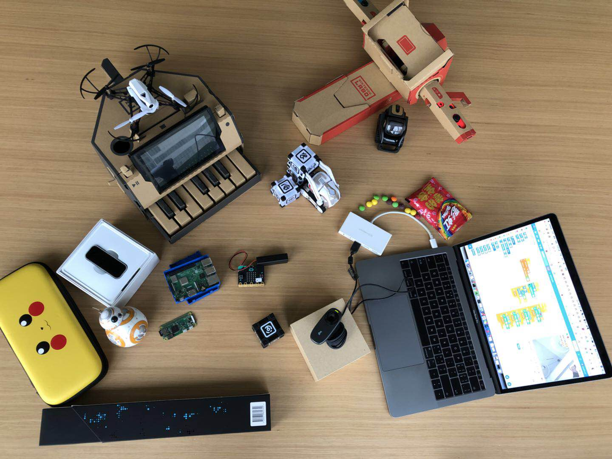

# CodeLab Adapter v2

> Turn the world into your playground!

!!! 提醒
    需要使用旧版本的用户请访问这里: [CodeLab Adapter v1](https://adapterv1.codelab.club/)。

CodeLab Adapter 是由[CodeLab](https://www.codelab.club/)构建的基础项目(v2 是最新版本)，致力于连接万物，无论是软件还是硬件，无论是 AI、开源硬件、现实世界的物体、还是虚拟世界的动画角色，在 CodeLab Adapter 的驱动下，皆可彼此互动。

目前，我们在 CodeLab Neverland 中使用 CodeLab Adapter。CodeLab Neverland 是一个由 CodeLab Adapter 驱动的可编程空间，空间里的所有事物皆可编程。

<!--看两个视频-->

<video width=40% src="http://scratch3-files.just4fun.site/wand.mp4" controls="controls"></video>

 

<video width=80% src="http://scratch3-files.just4fun.site/cube%20symphony.mp4" controls="controls"></video>

在 CodeLab Adapter 驱动的空间里，你可以与万物沟通，你可以让神经网络识别出你的身体部位，进而制作一个体感游戏, 或是通过算法让整个空间变得智能。你可以在朋友生日那天，在 Ta 进门的一刻，将手中的魔杖一挥，在空中划一个字母 L 的轨迹，瞬间，点亮房间里五彩的灯光。在这儿，你将轻松做出这样的魔杖。

这儿是一些[演示案例](/user_guide/gallery/)。

CodeLab Adapter 的一个典型用例，是将任何有趣的东西接入 Scratch3.0，接入之后你便能用 Scratch3.0 的积木来操控它，让它与任何接入 Scratch3.0 的物体互动。无论是来自现实世界的物体，还是来自虚拟世界的 AI 或动画角色，都能彼此互动，我们不想针对某个硬件产品发布一个客户端，我们相信创意来自广泛的连接，我们致力于做一个中立的东西，将 Scratch3.0 连接到更广阔的领域，我们想做到[宽围墙](http://learn.media.mit.edu/lcl/weeks/week5/)。

CodeLab Adapter 是一个跨平台跨语言的通用工具，你可以在多个平台上,将多种编程语言作为它的 client， 详情参考[Architecture](/dev_guide/Architecture/)。除了 Scratch3.0，CodeLab Adapter 目前也支持 Blockly、 Python、Javascript、SmallTalk，更多的编程语言支持目前还在开发中。

以下是一些接入列表:

### 硬件相关

- [micro:bit](http://microbit.org/)
- [Arduino](https://www.arduino.cc/)
- [Cozmo](https://www.anki.com/en-us/cozmo)
- [Vector](https://www.anki.com/en-us/vector)
- [BB8](https://store.sphero.com/products/bb-8-by-sphero)
- [树莓派](https://www.raspberrypi.org/)
- [智能家居](https://blog.just4fun.site/scratch3-smart-home.html)
- [Switch Labo](https://labo.nintendo.com/)
- [Switch Joy-Con](https://www.nintendo.com/switch/)
- 四轴飞行器
    - [Parrot](http://www.parrot.com.cn)的 3 个型号
    - DJI Tello
- [优必选 Alpha 系列机器人](https://www.ubtrobot.com/cn/products/e-bot/)
- Leju Robot
    - Pando
    - Aelos
- 脑电波传感器
- 掌控板
- 眼动仪
- ...

### AI 相关

- [微软认知服务](https://azure.microsoft.com/zh-cn/services/cognitive-services/)
- [本地化的机器视觉](https://js.tensorflow.org/)
- [opencv](https://opencv.org/)
- [tensorflow](https://github.com/tensorflow/tensorflow)
- Object Tracking
- 一些简单的本地自然语言处理(移植了 mit media lab 的实验项目)
- ...

### 软件相关

- blender
- wechat
- HCI
- ...

CodeLab Adapter 采用[插件式的设计](/dev_guide/Architecture/)，允许你自己动手写插件来拓展它，[开发手册](/dev_guide/helloworld/)将教会大家如何通过短短几行代码来自定义插件。

如果你有什么心仪的玩具，我们没有考虑到的，你可以将其自行接入。诸如我把童年玩的四驱车接入了进来:

<video width=40% src="http://wwj-fig-bed.just4fun.site/1539392124109888.mp4" controls="controls"></video>
