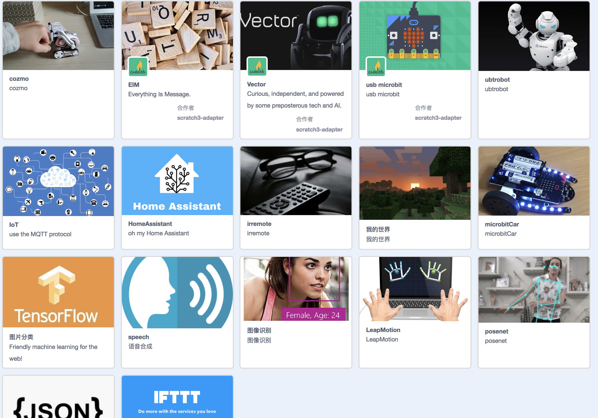

# Welcome to scratch3_adapter
scratch3_adapter是[Scratch3 Lab](https://blog.just4fun.site/Scratch3-Lab.html)的一个子项目

[Scratch3 Lab](https://blog.just4fun.site/Scratch3-Lab.html)是一个致力于将Scratch3接入开源硬件及AI的实验项目(Scratch3 Lab: connect Scratch3.0 to open-source hardware and AI)

使用scratch3_adapter，你可以轻松将任何有趣的东西接入scratch3.0(只需几行代码)，接入之后你便能用积木操控它，让它与任何接入scratch3.0的物体互动（无论是来自现实世界的物体，还是来自虚拟世界的AI或动画角色，都能彼此互动，我们尽量做到[宽围墙](http://learn.media.mit.edu/lcl/weeks/week5/)）

硬件方面,我们已经接入了:

*  [micro:bit](http://microbit.org/)
*  [Cozmo](https://www.anki.com/en-us/cozmo)
*  [BB8](https://store.sphero.com/products/bb-8-by-sphero)
*  [树莓派](https://www.raspberrypi.org/)
*  [智能家居](https://blog.just4fun.site/scratch3-smart-home.html)

AI方便，我们接入了:

*  [微软认知服务](https://azure.microsoft.com/zh-cn/services/cognitive-services/)
*  [本地化的机器视觉](https://js.tensorflow.org/)
*  [opencv](https://opencv.org/)
*  [实时物体检测](https://pjreddie.com/darknet/yolo/)
*  一些简单的本地自然语言处理(移植了mit media lab的实验项目)

scratch3_adapter采用插件式的设计，允许你自己动手写插件拓展它，我们将在文档中教大家如何通过短短几行代码来自定义插件

如果你有什么心仪的玩具，我们没有考虑到的，欢迎使用scratch3_adapter将它接入[Scratch3 Lab](https://blog.just4fun.site/Scratch3-Lab.html)，并与大家分享你的乐趣 :)

我最近正在把童年玩的的四驱车接入其中 :)

我正为Scratch3 Lab构建[社区](https://scratch3-groups.just4fun.site/)，大家有什么有趣的动手经历或想法，欢迎分享到社区，在这儿寻找志同道合的小伙伴，一起折腾好玩的东西。

>  如果你想走得快，一个人走; 如果你想走得远，一群人走

## 目前已支持的插件
这是[Scratch3 Lab](https://blog.just4fun.site/Scratch3-Lab.html)目前支持的部分插件截图
