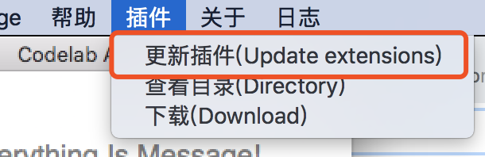

# 安装(install)

Codelab Adapter v2 目前发布了 Mac、Windows(支持 window7 及以上版本)、Ubuntu、Raspbian(树莓派)的客户端.

### 下载(最新版本: 2_3_1)

你可以免费下载 (点击对应的操作系统链接):

*  [Mac OS(64bit)](http://scratch3-files.just4fun.site/codelab-adapter-mac-2_3_1.zip)
    *  macOS 10.13.5+
    *  如果你点击应用闪退，请参考 :[打开来自身份不明开发者的应用](https://support.apple.com/kb/PH25088?locale=zh_CN&viewlocale=zh_CN)
* Windows(Windows7 及以上）
    * [Windows](http://scratch3-files.just4fun.site/codelab-adapter-2_3_1.exe.zip): windows7、windows10 已测试(32 位和 64 位都可用)
* linux
    * [Ubuntu(16.04 及以上版本)(64bit)](http://scratch3-files.just4fun.site/codelab-adapter-ubuntu_2_3_1.zip)
* [Raspbian](http://scratch3-files.just4fun.site/codelab-adapter-rpi-2_3_1.zip)
    * 下载，解压，赋予运行权限: `chmod +x xxx`

### 更新

如果你之前使用过旧版本的软件，更新到新版本后，建议也更新一下插件目录(`~/codelab_adapter/extensions/`)

旧的插件会被备份到同级目录(如`extensions_1540437691`)。

### 兼容性

目前, Windows 和 Mac 的版本测试过的机器比较多。

Ubuntu 测试了 16.04 及 18.04, Ubuntu(16.04 及以上版本)也可用于 Arch linux，如果你在使用其他 linux 发行版，也可以试试。

Raspbian 我们只测试了最新版本,如果有系统兼容性问题，欢迎[联系我们](/about/contact/)

<!--
ps: MacOS 10.14 下，按钮无法显示文字, 但不影响正常使用 (按钮文字 可以参考下图)

-->
