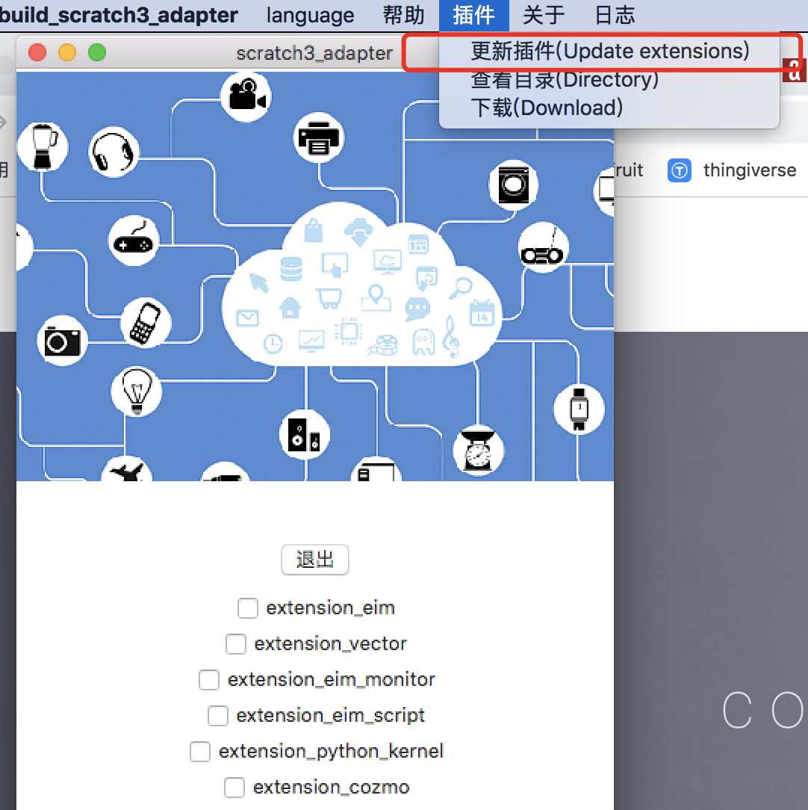

# 安装(install)
codelab-adapter目前发布了Mac、Windows(支持window7及以上版本)、Ubuntu、Raspbian(树莓派)的客户端

### 下载(最新版本:v0_8_4)
你可以免费下载 (点击对应的操作系统链接):

请下载:[测试版](/user_guide/develop/)

<!--
*  [Mac OS(64bit)](http://scratch3-files.just4fun.site/v0_8_4_codelab_adapter_mac.zip)
    *  macOS 10.13.5+
    *  如果你点击应用闪退，请参考 :[打开来自身份不明开发者的应用](https://support.apple.com/kb/PH25088?locale=zh_CN&viewlocale=zh_CN)
*  Windows(Windows7及以上）
    *  [Windows](http://scratch3-files.just4fun.site/v0_8_4_codelab_adapter_win.exe.zip): windows7、windows10已测试(32位和64位都可用)
*  linux
    *  [Ubuntu(16.04及以上版本)(64bit)](http://scratch3-files.just4fun.site/v0_8_4_codelab_adapter_ubuntu.zip)
    *  [Raspbian](http://scratch3-files.just4fun.site/v0_8_4_codelab_adapter_raspbian.zip)
        *  下载，解压，赋予运行权限: `chmod +x v0_8_4_codelab_adapter_raspbian`
-->

### 更新
如果你之前使用过旧版本的软件，更新到新版本后，建议也更新一下插件目录(`~/codelab_adapter/extensions/`)

旧的插件会被备份到同级目录(如`extensions_1540437691`)

<!--
### 兼容性
目前,Windows和Mac的版本测试过的机器比较多。

Ubuntu测试了16.04及18.04, Ubuntu(16.04及以上版本)也可用于Arch linux，如果你在使用其他linux发行版，也可以试试。

Raspbian我们只测试了Stretch版本,如果有系统兼容性问题，欢迎[联系我们](/about/contact/)

ps: MacOS10.14下，按钮无法显示文字, 但不影响正常使用 (按钮文字 可以参考下图)

-->