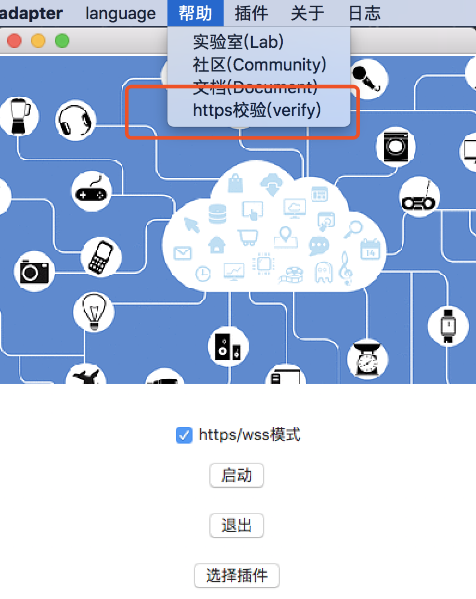
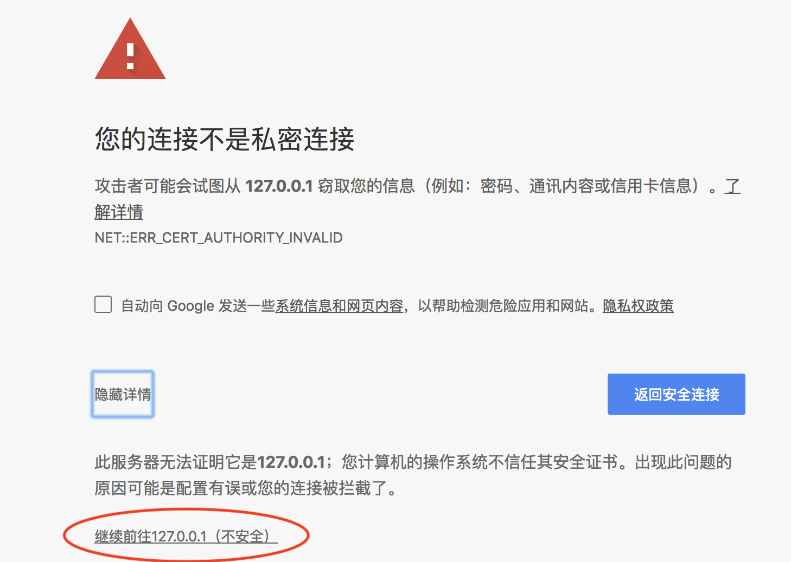
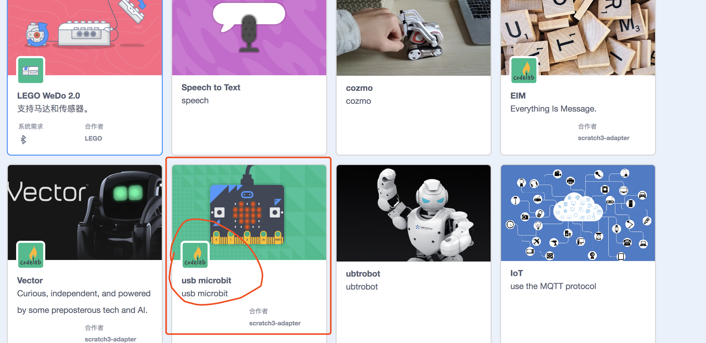

# 使用说明(usage)

我们以使用预加载的插件为例，在此我们演示如何在scratch3.0中使用micro:bit

### 步骤1: 打开Scratch3 Lab
推荐使用[Chrome浏览器](https://www.google.cn/chrome/index.html)点击打开[Scratch3 Lab](https://scratch3.just4fun.site/)，目前Scratch官方团队在目录支持更多浏览器版本，现阶段使用Chrome浏览器效果最佳

<!--目前Scratch3 Lab的服务器在香港，第一次加载，你需要耐心等待一段时间(之后打开就快了)-->

### 步骤2: 打开scratch3_adapter
双击打开scratch3-adapter

<!---->

scratch3-adapter启动之后，可以看到[Scratch3 Lab](https://scratch3.just4fun.site/)指示灯显示绿色,代表连接成功

<!--
### 步骤3: https检验(只需要验证一次)
如果你是第一次使用scratch3_adapter，则需要点击scratch3_adapter菜单栏中的`https检验`

在自动打开的页面里依次点击`高级 > 继续前往127.0.0.1（不安全）`

完成之后，scratch3_adapter就可以与Scratch3 Lab建立连接了
-->

### 步骤3: 连接micro:bit，加载插件
使用数据线将micro:bit接入电脑，下载<a href="../../img/microbit_cx.hex" target="_blank">microbit_cx.hex</a>并拖入micro:bit中

ps: Windows7用户注意(Mac和Windows10用户可以跳过),为了能发现并连接micro:bit，需要[安装驱动](../../img/mbedWinSerial_16466.exe)(和使用mu-editor操作相同)

完成后在scratch3_adapter中点击加载micro:bit插件

你应该看到micro:bit背后的信号灯高频闪烁，如果它没有高频闪烁，则按一下micro:bit背部的复位按钮

ps: linux用户注意，scratch3_adapter使用usb串口与micro:bit连接,linux下，使用usb串口需要做权限设置:`sudo chmod 666 /dev/ttyACM0`

### 步骤4: 打印hello world
现在让我们利用Scratch3 Lab控制micro:bit，让它在点阵屏上打印`hello world`

选择对应的scratch3插件:Microbit_cx(我们同时制作了若干中micro:bit，包括使用web蓝牙的)

接着拓展积木，点击运行

# 结语
这个例子完整展示了scratch3_adapter的使用流程

*  接入你的硬件(可以是任何开源硬件)
*  启动scratch3_adapter,加载对应硬件插件
*  打开scratch3.0网页
*  开始在scratch3.0中与硬件交互

其中步骤2是关键，如果你接入的硬件目前没有默认插件支持它，你可以自己来写，scratch3_adapter允许你将任何硬件接入scratch3.0中，别害怕，需要的代码很少也很简单，详情参见[开发手册](/dev_guide/helloworld/)

我们也将在[extension guide](/extension_guide/introduction/)中介绍各种社区插件的使用方法